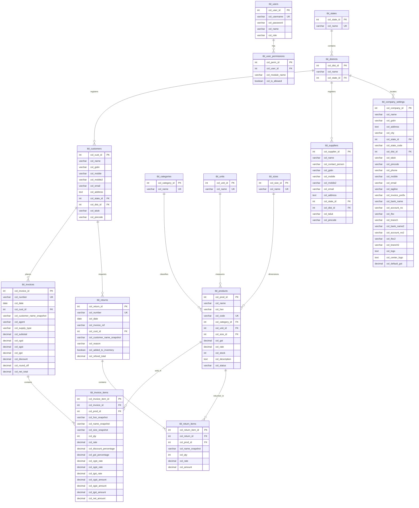

# Database Schema Specification (`fab_billing_database`)

This document defines the schema structure for **fab_billing_database**, incorporating a strict prefix naming convention (`tbl_` for tables, `col_` for columns) and normalization of lookup fields.

All primary keys use a table-specific identifier format (e.g., `col_dist_id` for districts, `col_prod_id` for products) and all foreign keys matching those columns use the exact same name across all tables.

---

## 1. Naming Conventions & Design Rules

To ensure a highly maintainable and clean structure, the following guidelines are implemented:
1. **Database Name**: `fab_billing_database`
2. **Table Prefix**: All tables start with `tbl_` (e.g., `tbl_products`, `tbl_customers`).
3. **Column Prefix**: All columns start with `col_` (e.g., `col_state_id`, `col_name`).
4. **Primary and Foreign Key Match**: Every table has its own unique primary key named `col_<entity>_id`. Any table referencing that entity uses the exact same column name as its foreign key.
5. **Location Hierarchy (States and Districts)**:
   * District data is normalized into `tbl_districts` containing `col_dist_id` and a foreign key to `tbl_states` (`col_state_id`).
   * Tables referencing locations (like customers, suppliers, and company settings) integrate via `col_dist_id` and `col_state_id` as foreign keys.

---

## 2. Entity-Relationship Diagram (ERD)

The following diagram illustrates the relationship between the normalized tables with the updated naming conventions.



---

## 3. Data Dictionary

### `tbl_company_settings`
Stores organization details for the shop generating bills.
* **Columns**:
  * `col_company_id` (INT PK): Primary Key (Value `1`).
  * `col_name` (VARCHAR, 150): Shop name.
  * `col_gstin` (VARCHAR, 15): GST Identification Number.
  * `col_address` (TEXT): Postal street address.
  * `col_city` (VARCHAR, 100): City name.
  * `col_state_id` (INT FK): Links to `tbl_states.col_state_id`.
  * `col_state_code` (VARCHAR, 2): State GST ID (e.g. `33`).
  * `col_dist_id` (INT FK): Links to `tbl_districts.col_dist_id`.
  * `col_taluk` (VARCHAR, 100): Taluk name.
  * `col_pincode` (VARCHAR, 6): Postal Code.
  * `col_phone` (VARCHAR, 20): Landline telephone number.
  * `col_mobile` (VARCHAR, 15): Mobile phone number.
  * `col_email` (VARCHAR, 255): Business email.
  * `col_tagline` (VARCHAR, 255): Tagline or motto.
  * `col_invoice_prefix` (VARCHAR, 10): Default invoice prefix (e.g. `INV`).
  * `col_bank_name` (VARCHAR, 150): Bank name.
  * `col_account_no` (VARCHAR, 50): Bank Account.
  * `col_ifsc` (VARCHAR, 11): Bank IFSC code.
  * `col_branch` (VARCHAR, 150): Bank branch location.
  * `col_bank_name2` / `col_account_no2` / `col_ifsc2` / `col_branch2`: Secondary bank options (optional).
  * `col_logo` / `col_center_logo` (TEXT): Base64 logo details.
  * `col_default_gst` (DECIMAL(5,2)): Default GST rate.

### `tbl_users`
Handles client sessions and access checks.
* **Columns**:
  * `col_user_id` (INT PK Auto-Increment): Unique ID.
  * `col_username` (VARCHAR, 50 UNIQUE): Login username.
  * `col_password` (VARCHAR, 255): Password.
  * `col_name` (VARCHAR, 100): User display name.
  * `col_role` (VARCHAR, 20): Operational role (e.g. `Admin`, `Staff`).

### `tbl_user_permissions`
Handles granular access control settings.
* **Columns**:
  * `col_perm_id` (INT PK Auto-Increment): Unique ID.
  * `col_user_id` (INT FK): Links to `tbl_users.col_user_id`.
  * `col_module_name` (VARCHAR, 50): Page/tab name (e.g. `invoices`, `settings`).
  * `col_is_allowed` (BOOLEAN): Access flag.

### `tbl_products`
Stock list catalog.
* **Columns**:
  * `col_prod_id` (INT PK Auto-Increment): Unique ID.
  * `col_name` (VARCHAR, 255): Item description.
  * `col_hsn` (VARCHAR, 10): HSN tax category code.
  * `col_code` (VARCHAR, 50 UNIQUE): Product code / SKU.
  * `col_category_id` (INT FK): Links to `tbl_categories.col_category_id`.
  * `col_unit_id` (INT FK): Links to `tbl_units.col_unit_id`.
  * `col_size_id` (INT FK): Links to `tbl_sizes.col_size_id`.
  * `col_gst` (DECIMAL(5,2)): GST rate bracket.
  * `col_rate` (DECIMAL(12,2)): Selling unit price.
  * `col_stock` (INT): Quantity in shop.
  * `col_description` (TEXT): Extended item details.
  * `col_status` (VARCHAR, 20): Operational status (`active` / `inactive`).

### `tbl_customers` & `tbl_suppliers`
Third-party entities.
* **Columns in `tbl_customers`**:
  * `col_cust_id` (INT PK Auto-Increment): Unique customer ID.
  * `col_name` (VARCHAR, 150): Customer name.
  * `col_gstin` (VARCHAR, 15): Customer's GST number (optional).
  * `col_mobile` (VARCHAR, 15): Primary mobile.
  * `col_mobile2` (VARCHAR, 15): Secondary mobile (optional).
  * `col_email` (VARCHAR, 255): Customer email.
  * `col_address` (TEXT): Delivery/billing address.
  * `col_state_id` (INT FK): Links to `tbl_states.col_state_id`.
  * `col_dist_id` (INT FK): Links to `tbl_districts.col_dist_id`.
  * `col_taluk` (VARCHAR, 100): Area taluk.
  * `col_pincode` (VARCHAR, 6): Postal code.
* **Columns in `tbl_suppliers`**:
  * `col_supplier_id` (INT PK Auto-Increment): Unique supplier ID.
  * `col_name` (VARCHAR, 150): Supplier name.
  * `col_contact_person` (VARCHAR, 150): Contact name.
  * `col_gstin` (VARCHAR, 15): Supplier GSTIN.
  * `col_mobile` / `col_mobile2` / `col_email` / `col_address`: Contact particulars.
  * `col_state_id` (INT FK): Links to `tbl_states.col_state_id`.
  * `col_dist_id` (INT FK): Links to `tbl_districts.col_dist_id`.
  * `col_taluk` (VARCHAR, 100): Taluk name.
  * `col_pincode` (VARCHAR, 6): Postal code.

### `tbl_invoices` & `tbl_invoice_items`
Sales records.
* **Columns in `tbl_invoices`**:
  * `col_invoice_id` (INT PK Auto-Increment): Invoice database ID.
  * `col_number` (VARCHAR, 50 UNIQUE): Display number (e.g. `INV-2025-001`).
  * `col_date` (DATE): Billing date.
  * `col_cust_id` (INT FK): Links to `tbl_customers.col_cust_id`.
  * `col_customer_name_snapshot` (VARCHAR, 150): Historical snapshot of customer name.
  * `col_agent` (VARCHAR, 100): Counter agent who sold.
  * `col_supply_type` (VARCHAR, 20): Supply region mode (`Intra-State` / `Inter-State`).
  * `col_subtotal` / `col_cgst` / `col_sgst` / `col_igst` / `col_discount` / `col_round_off` / `col_net_total` (DECIMAL): Financial aggregates.
* **Columns in `tbl_invoice_items`**:
  * `col_invoice_item_id` (INT PK Auto-Increment): Invoice line database ID.
  * `col_invoice_id` (INT FK): Links to `tbl_invoices.col_invoice_id`.
  * `col_prod_id` (INT FK): Links to `tbl_products.col_prod_id`.
  * `col_hsn_snapshot` / `col_name_snapshot` / `col_size_snapshot` (VARCHAR): Product state backup.
  * `col_qty` (INT): Units purchased.
  * `col_rate` (DECIMAL(12,2)): Sales rate.
  * `col_discount_percentage` (DECIMAL(5,2)): Item discount rate.
  * `col_gst_percentage` (DECIMAL(5,2)): Item GST bracket.
  * `col_cgst_rate` / `col_sgst_rate` / `col_igst_rate` (DECIMAL(5,2)): Tax breakdown percentages.
  * `col_cgst_amount` / `col_sgst_amount` / `col_igst_amount` (DECIMAL(12,2)): Tax values.
  * `col_net_amount` (DECIMAL(12,2)): Line total.

### `tbl_returns` & `tbl_return_items`
Sales returns.
* **Columns in `tbl_returns`**:
  * `col_return_id` (INT PK Auto-Increment): Return database ID.
  * `col_number` (VARCHAR, 50 UNIQUE): Return note serial code.
  * `col_date` (DATE): Creation date.
  * `col_invoice_ref` (VARCHAR, 50): Target invoice code.
  * `col_cust_id` (INT FK): Links to `tbl_customers.col_cust_id`.
  * `col_customer_name_snapshot` (VARCHAR, 150): Customer name.
  * `col_reason` (VARCHAR, 255): Reason for return.
  * `col_added_to_inventory` (BOOLEAN): Refilled stock flag.
  * `col_refund_total` (DECIMAL(12,2)): Money refunded.
* **Columns in `tbl_return_items`**:
  * `col_return_item_id` (INT PK Auto-Increment): Return item database ID.
  * `col_return_id` (INT FK): Links to `tbl_returns.col_return_id`.
  * `col_prod_id` (INT FK): Links to `tbl_products.col_prod_id`.
  * `col_name_snapshot` (VARCHAR, 255): Item name snapshot.
  * `col_qty` (INT): Return quantity.
  * `col_rate` (DECIMAL(12,2)): Item base rate.
  * `col_amount` (DECIMAL(12,2)): Refund line total.

---

## 4. SQL DDL Scripts (PostgreSQL Schema)

```sql
-- Create Lookup tables
CREATE TABLE tbl_categories (
    col_category_id SERIAL PRIMARY KEY,
    col_name VARCHAR(100) UNIQUE NOT NULL
);

CREATE TABLE tbl_units (
    col_unit_id SERIAL PRIMARY KEY,
    col_name VARCHAR(100) UNIQUE NOT NULL
);

CREATE TABLE tbl_sizes (
    col_size_id SERIAL PRIMARY KEY,
    col_name VARCHAR(100) UNIQUE NOT NULL
);

CREATE TABLE tbl_states (
    col_state_id SERIAL PRIMARY KEY,
    col_name VARCHAR(100) UNIQUE NOT NULL
);

CREATE TABLE tbl_districts (
    col_dist_id SERIAL PRIMARY KEY,
    col_name VARCHAR(100) NOT NULL,
    col_state_id INT NOT NULL REFERENCES tbl_states(col_state_id) ON DELETE CASCADE
);

-- Company Settings
CREATE TABLE tbl_company_settings (
    col_company_id INT PRIMARY KEY DEFAULT 1 CHECK (col_company_id = 1),
    col_name VARCHAR(150) NOT NULL,
    col_gstin VARCHAR(15),
    col_address TEXT,
    col_city VARCHAR(100),
    col_state_id INT REFERENCES tbl_states(col_state_id) ON DELETE SET NULL,
    col_state_code VARCHAR(2),
    col_dist_id INT REFERENCES tbl_districts(col_dist_id) ON DELETE SET NULL,
    col_taluk VARCHAR(100),
    col_pincode VARCHAR(6),
    col_phone VARCHAR(20),
    col_mobile VARCHAR(15),
    col_email VARCHAR(255),
    col_tagline VARCHAR(255),
    col_invoice_prefix VARCHAR(10) DEFAULT 'INV',
    col_bank_name VARCHAR(150),
    col_account_no VARCHAR(50),
    col_ifsc VARCHAR(11),
    col_branch VARCHAR(150),
    col_bank_name2 VARCHAR(150),
    col_account_no2 VARCHAR(50),
    col_ifsc2 VARCHAR(11),
    col_branch2 VARCHAR(150),
    col_logo TEXT,
    col_center_logo TEXT,
    col_default_gst DECIMAL(5,2) DEFAULT 18.00
);

-- Users & Permissions
CREATE TABLE tbl_users (
    col_user_id SERIAL PRIMARY KEY,
    col_username VARCHAR(50) UNIQUE NOT NULL,
    col_password VARCHAR(255) NOT NULL,
    col_name VARCHAR(100) NOT NULL,
    col_role VARCHAR(20) NOT NULL DEFAULT 'Staff'
);

CREATE TABLE tbl_user_permissions (
    col_perm_id SERIAL PRIMARY KEY,
    col_user_id INT NOT NULL REFERENCES tbl_users(col_user_id) ON DELETE CASCADE,
    col_module_name VARCHAR(50) NOT NULL,
    col_is_allowed BOOLEAN NOT NULL DEFAULT FALSE,
    CONSTRAINT uq_user_module UNIQUE (col_user_id, col_module_name)
);

-- Products Catalog
CREATE TABLE tbl_products (
    col_prod_id SERIAL PRIMARY KEY,
    col_name VARCHAR(255) NOT NULL,
    col_hsn VARCHAR(10),
    col_code VARCHAR(50) UNIQUE,
    col_category_id INT REFERENCES tbl_categories(col_category_id) ON DELETE SET NULL,
    col_unit_id INT REFERENCES tbl_units(col_unit_id) ON DELETE SET NULL,
    col_size_id INT REFERENCES tbl_sizes(col_size_id) ON DELETE SET NULL,
    col_gst DECIMAL(5,2) NOT NULL DEFAULT 5.00,
    col_rate DECIMAL(12,2) NOT NULL DEFAULT 0.00,
    col_stock INT NOT NULL DEFAULT 0,
    col_description TEXT,
    col_status VARCHAR(20) NOT NULL DEFAULT 'active'
);

-- Customers & Suppliers
CREATE TABLE tbl_customers (
    col_cust_id SERIAL PRIMARY KEY,
    col_name VARCHAR(150) NOT NULL,
    col_gstin VARCHAR(15),
    col_mobile VARCHAR(15) NOT NULL,
    col_mobile2 VARCHAR(15),
    col_email VARCHAR(255),
    col_address TEXT NOT NULL,
    col_state_id INT REFERENCES tbl_states(col_state_id) ON DELETE SET NULL,
    col_dist_id INT REFERENCES tbl_districts(col_dist_id) ON DELETE SET NULL,
    col_taluk VARCHAR(100),
    col_pincode VARCHAR(6)
);

CREATE TABLE tbl_suppliers (
    col_supplier_id SERIAL PRIMARY KEY,
    col_name VARCHAR(150) NOT NULL,
    col_contact_person VARCHAR(150),
    col_gstin VARCHAR(15),
    col_mobile VARCHAR(15) NOT NULL,
    col_mobile2 VARCHAR(15),
    col_email VARCHAR(255),
    col_address TEXT NOT NULL,
    col_state_id INT REFERENCES tbl_states(col_state_id) ON DELETE SET NULL,
    col_dist_id INT REFERENCES tbl_districts(col_dist_id) ON DELETE SET NULL,
    col_taluk VARCHAR(100),
    col_pincode VARCHAR(6)
);

-- Invoices & Invoice Items
CREATE TABLE tbl_invoices (
    col_invoice_id SERIAL PRIMARY KEY,
    col_number VARCHAR(50) UNIQUE NOT NULL,
    col_date DATE NOT NULL DEFAULT CURRENT_DATE,
    col_cust_id INT REFERENCES tbl_customers(col_cust_id) ON DELETE SET NULL,
    col_customer_name_snapshot VARCHAR(150) NOT NULL,
    col_agent VARCHAR(100) DEFAULT 'Self',
    col_supply_type VARCHAR(20) NOT NULL DEFAULT 'Intra-State',
    col_subtotal DECIMAL(12,2) NOT NULL DEFAULT 0.00,
    col_cgst DECIMAL(12,2) NOT NULL DEFAULT 0.00,
    col_sgst DECIMAL(12,2) NOT NULL DEFAULT 0.00,
    col_igst DECIMAL(12,2) NOT NULL DEFAULT 0.00,
    col_discount DECIMAL(12,2) NOT NULL DEFAULT 0.00,
    col_round_off DECIMAL(5,2) NOT NULL DEFAULT 0.00,
    col_net_total DECIMAL(12,2) NOT NULL DEFAULT 0.00
);

CREATE TABLE tbl_invoice_items (
    col_invoice_item_id SERIAL PRIMARY KEY,
    col_invoice_id INT NOT NULL REFERENCES tbl_invoices(col_invoice_id) ON DELETE CASCADE,
    col_prod_id INT REFERENCES tbl_products(col_prod_id) ON DELETE SET NULL,
    col_hsn_snapshot VARCHAR(10),
    col_name_snapshot VARCHAR(255) NOT NULL,
    col_size_snapshot VARCHAR(50),
    col_qty INT NOT NULL CHECK (col_qty > 0),
    col_rate DECIMAL(12,2) NOT NULL,
    col_discount_percentage DECIMAL(5,2) NOT NULL DEFAULT 0.00,
    col_gst_percentage DECIMAL(5,2) NOT NULL DEFAULT 0.00,
    col_cgst_rate DECIMAL(5,2) NOT NULL DEFAULT 0.00,
    col_sgst_rate DECIMAL(5,2) NOT NULL DEFAULT 0.00,
    col_igst_rate DECIMAL(5,2) NOT NULL DEFAULT 0.00,
    col_cgst_amount DECIMAL(12,2) NOT NULL DEFAULT 0.00,
    col_sgst_amount DECIMAL(12,2) NOT NULL DEFAULT 0.00,
    col_igst_amount DECIMAL(12,2) NOT NULL DEFAULT 0.00,
    col_net_amount DECIMAL(12,2) NOT NULL DEFAULT 0.00
);

-- Returns & Return Items
CREATE TABLE tbl_returns (
    col_return_id SERIAL PRIMARY KEY,
    col_number VARCHAR(50) UNIQUE NOT NULL,
    col_date DATE NOT NULL DEFAULT CURRENT_DATE,
    col_invoice_ref VARCHAR(50) NOT NULL,
    col_cust_id INT REFERENCES tbl_customers(col_cust_id) ON DELETE SET NULL,
    col_customer_name_snapshot VARCHAR(150) NOT NULL,
    col_reason VARCHAR(255) NOT NULL,
    col_added_to_inventory BOOLEAN NOT NULL DEFAULT TRUE,
    col_refund_total DECIMAL(12,2) NOT NULL DEFAULT 0.00
);

CREATE TABLE tbl_return_items (
    col_return_item_id SERIAL PRIMARY KEY,
    col_return_id INT NOT NULL REFERENCES tbl_returns(col_return_id) ON DELETE CASCADE,
    col_prod_id INT REFERENCES tbl_products(col_prod_id) ON DELETE SET NULL,
    col_name_snapshot VARCHAR(255) NOT NULL,
    col_qty INT NOT NULL CHECK (col_qty > 0),
    col_rate DECIMAL(12,2) NOT NULL,
    col_amount DECIMAL(12,2) NOT NULL DEFAULT 0.00
);
```

---

## 5. Mock Data Seeding Scripts (SQL Inserts)

```sql
-- 1. Seed lookup lists
INSERT INTO tbl_categories (col_category_id, col_name) VALUES 
(1, 'Sarees'), (2, 'Shirts'), (3, 'Dress Materials'), (4, 'Kids Wear'), 
(5, 'Trousers'), (6, 'Home Textile'), (7, 'Bottom Wear'), (8, 'Traditional'), 
(9, 'Jackets'), (10, 'Accessories');

INSERT INTO tbl_units (col_unit_id, col_name) VALUES 
(1, 'Pcs'), (2, 'Set'), (3, 'Mtr'), (4, 'Kg'), (5, 'Ltr'), (6, 'Box'), (7, 'Pair'), (8, 'Dozen');

INSERT INTO tbl_sizes (col_size_id, col_name) VALUES 
(1, 'S'), (2, 'M'), (3, 'L'), (4, 'XL'), (5, 'XXL'), (6, '38'), (7, '40'), (8, '42'), (9, 'Free Size');

INSERT INTO tbl_states (col_state_id, col_name) VALUES 
(1, 'Tamil Nadu'),
(2, 'Maharashtra'),
(3, 'Delhi');

-- 2. Seed districts
INSERT INTO tbl_districts (col_dist_id, col_name, col_state_id) VALUES
(1, 'Chennai', 1),
(2, 'Thane', 2),
(3, 'New Delhi', 3);

-- 3. Seed Company settings
INSERT INTO tbl_company_settings (col_company_id, col_name, col_gstin, col_address, col_city, col_state_id, col_state_code, col_dist_id, col_taluk, col_pincode, col_phone, col_mobile, col_email, col_tagline, col_invoice_prefix, col_bank_name, col_account_no, col_ifsc, col_branch) VALUES
(1, 'Shree Textiles', '33AABCT1332L1ZZ', '123, Main Road, T.Nagar', 'Chennai', 1, '33', 1, 'Teynampet', '600017', '044-2434-5678', '9876543210', 'info@shreetextiles.com', '', 'INV', 'State Bank of India', '1234567890', 'SBIN0001234', 'T.Nagar Branch');

-- 4. Seed system users
INSERT INTO tbl_users (col_user_id, col_username, col_password, col_name, col_role) VALUES 
(1, 'admin', 'admin', 'Admin', 'Admin'),
(2, 'staff', 'staff', 'Staff Member', 'Staff');

-- 5. Seed user access permissions
INSERT INTO tbl_user_permissions (col_perm_id, col_user_id, col_module_name, col_is_allowed) VALUES
(1, 1, 'dashboard', TRUE), (2, 1, 'products', TRUE), (3, 1, 'customers', TRUE), (4, 1, 'suppliers', TRUE), (5, 1, 'invoices', TRUE), (6, 1, 'returns', TRUE), (7, 1, 'inventory', TRUE), (8, 1, 'reports', TRUE), (9, 1, 'settings', TRUE),
(10, 2, 'dashboard', TRUE), (11, 2, 'products', TRUE), (12, 2, 'customers', TRUE), (13, 2, 'suppliers', FALSE), (14, 2, 'invoices', TRUE), (15, 2, 'returns', FALSE), (16, 2, 'inventory', TRUE), (17, 2, 'reports', FALSE), (18, 2, 'settings', FALSE);

-- 6. Seed product inventory items
INSERT INTO tbl_products (col_prod_id, col_name, col_hsn, col_code, col_category_id, col_unit_id, col_size_id, col_gst, col_rate, col_stock, col_description, col_status) VALUES
(1, 'Cotton Saree - Kanchipuram', '5208', 'TEX001', 1, 1, NULL, 5.00, 2500.00, 45, 'Premium handloom cotton saree', 'active'),
(2, 'Silk Saree - Banarasi', '5007', 'TEX002', 1, 1, NULL, 5.00, 4500.00, 30, 'Pure silk banarasi saree', 'active'),
(3, 'Men Formal Shirt - White', '6205', 'TEX003', 2, 1, NULL, 5.00, 850.00, 120, 'Cotton formal shirt', 'active'),
(4, 'Ladies Churidar Set', '6204', 'TEX004', 3, 2, NULL, 5.00, 1200.00, 65, 'Cotton churidar with dupatta', 'active'),
(5, 'Kids T-Shirt - Printed', '6109', 'TEX005', 4, 1, NULL, 5.00, 350.00, 200, 'Printed cotton t-shirt for kids', 'active'),
(6, 'Men Denim Jeans', '6203', 'TEX006', 5, 1, NULL, 12.00, 1450.00, 80, 'Slim fit denim jeans', 'active'),
(7, 'Bedsheet Double - Floral', '6302', 'TEX007', 6, 2, NULL, 5.00, 950.00, 55, 'Double bedsheet with 2 pillow covers', 'active'),
(8, 'Towel Bath - Premium', '6302', 'TEX008', 6, 1, NULL, 5.00, 320.00, 8, 'Premium cotton bath towel', 'active'),
(9, 'Ladies Leggings', '6104', 'TEX009', 7, 1, NULL, 5.00, 280.00, 150, 'Stretchable cotton leggings', 'active'),
(10, 'Silk Dhoti - Cream', '5007', 'TEX010', 8, 1, NULL, 5.00, 680.00, 3, 'Pure silk dhoti', 'active'),
(11, 'Winter Jacket - Men', '6201', 'TEX011', 9, 1, NULL, 12.00, 2200.00, 35, 'Padded winter jacket', 'active'),
(12, 'Curtain Set - Eyelet', '6303', 'TEX012', 6, 2, NULL, 12.00, 1800.00, 5, 'Eyelet curtain with lining', 'inactive');

-- 7. Seed client details
INSERT INTO tbl_customers (col_cust_id, col_name, col_gstin, col_mobile, col_email, col_address, col_state_id, col_dist_id, col_taluk, col_pincode) VALUES
(1, 'Rajesh Kumar', '33AADCR9876K1ZZ', '9876501234', 'rajesh@example.com', '45, Mount Road', 1, 1, 'Egmore', '600032'),
(2, 'Lakshmi Traders', '33AABCL5432M1ZZ', '9876502345', 'lakshmi@traders.com', '78, Anna Salai', 1, 1, 'Teynampet', '600002'),
(3, 'Priya Fashions', '33AABCP3210N1ZZ', '9876503456', 'priya@fashions.com', '12, Ranganathan Street', 1, 1, 'T. Nagar', '600017'),
(4, 'Mohammed Ismail', '', '9876504567', 'ismail@email.com', '90, George Town', 1, 1, 'George Town', '600001'),
(5, 'Anita Sharma', '07AADCA7654P1ZZ', '9876505678', 'anita@sharma.com', '34, Connaught Place', 3, 3, 'Connaught Place', '110001'),
(6, 'Ganesh Textiles', '33AABCG2109Q1ZZ', '9876506789', 'ganesh@textiles.com', '56, Godown Street', 1, 1, 'Parrys', '600001'),
(7, 'Sunita Devi', '', '9876507890', '', '23, Main Bazaar', 1, 1, 'Avadi', '600040'),
(8, 'Karthik Stores', '33AABCK8765R1ZZ', '9876508901', 'karthik@stores.com', '67, Usman Road', 1, 1, 'T. Nagar', '600017');

-- 8. Seed suppliers
INSERT INTO tbl_suppliers (col_supplier_id, col_name, col_contact_person, col_gstin, col_mobile, col_mobile2, col_email, col_address, col_state_id, col_dist_id, col_taluk, col_pincode) VALUES
(1, 'Supreme Fabricators', 'Arun Kumar', '33AABCS1234K1ZZ', '9876543210', '9876543211', 'supreme@fab.com', 'B-24, Industrial Estate', 1, 1, 'Guindy', '600032'),
(2, 'Apex Steel Industries', 'Vijay Verma', '27AABCA4567R1ZZ', '9123456789', '', 'sales@apexsteel.com', '102, Wagle Estate', 2, 2, 'Thane', '400604');

-- 9. Seed invoices
INSERT INTO tbl_invoices (col_invoice_id, col_number, col_date, col_cust_id, col_customer_name_snapshot, col_agent, col_supply_type, col_subtotal, col_cgst, col_sgst, col_igst, col_discount, col_round_off, col_net_total) VALUES
(1, 'INV-2025-001', '2025-05-20', 1, 'Rajesh Kumar', 'Self', 'Intra-State', 7550.00, 188.75, 188.75, 0.00, 0.00, 0.50, 7928.00),
(2, 'INV-2025-002', '2025-05-21', 2, 'Lakshmi Traders', 'Agent A', 'Intra-State', 19775.00, 1126.50, 1126.50, 0.00, 725.00, 0.00, 22028.00),
(3, 'INV-2025-003', '2025-05-22', 3, 'Priya Fashions', 'Self', 'Intra-State', 4500.00, 112.50, 112.50, 0.00, 0.00, 0.00, 4725.00);

-- 10. Seed invoice detailed lines
INSERT INTO tbl_invoice_items (col_invoice_item_id, col_invoice_id, col_prod_id, col_hsn_snapshot, col_name_snapshot, col_size_snapshot, col_qty, col_rate, col_discount_percentage, col_gst_percentage, col_cgst_rate, col_sgst_rate, col_igst_rate, col_cgst_amount, col_sgst_amount, col_igst_amount, col_net_amount) VALUES
(1, 1, 1, '5208', 'Cotton Saree - Kanchipuram', '', 2, 2500.00, 0.00, 5.00, 2.50, 2.50, 0.00, 125.00, 125.00, 0.00, 5250.00),
(2, 1, 3, '6205', 'Men Formal Shirt - White', '', 3, 850.00, 0.00, 5.00, 2.50, 2.50, 0.00, 63.75, 63.75, 0.00, 2677.50),
(3, 2, 6, '6203', 'Men Denim Jeans', '', 10, 1450.00, 5.00, 12.00, 6.00, 6.00, 0.00, 826.50, 826.50, 0.00, 15428.00),
(4, 2, 4, '6204', 'Ladies Churidar Set', '', 5, 1200.00, 0.00, 5.00, 2.50, 2.50, 0.00, 300.00, 300.00, 0.00, 6600.00),
(5, 3, 2, '5007', 'Silk Saree - Banarasi', '', 1, 4500.00, 0.00, 5.00, 2.50, 2.50, 0.00, 112.50, 112.50, 0.00, 4725.00);

-- 11. Seed returns note
INSERT INTO tbl_returns (col_return_id, col_number, col_date, col_invoice_ref, col_cust_id, col_customer_name_snapshot, col_reason, col_added_to_inventory, col_refund_total) VALUES
(1, 'RET-2025-001', '2025-05-21', 'INV-2025-001', 1, 'Rajesh Kumar', 'Defective product', TRUE, 893.00);

-- 12. Seed return detailed lines
INSERT INTO tbl_return_items (col_return_item_id, col_return_id, col_prod_id, col_name_snapshot, col_qty, col_rate, col_amount) VALUES
(1, 1, 3, 'Men Formal Shirt - White', 1, 850.00, 893.00);
```
