# Database Schema Specification (`fab_billing_database`)

This document defines the schema structure for **fab_billing_database**, incorporating a strict prefix naming convention (`tbl_` for tables, `col_` for columns) and normalization of lookup fields.

All primary keys use a table-specific identifier format (e.g., `dist_id` for districts, `prod_id` for products) and all foreign keys matching those columns use the exact same name across all tables.

---

## 1. Naming Conventions & Design Rules

To ensure a highly maintainable and clean structure, the following guidelines are implemented:
1. **Database Name**: `fab_billing_database`
2. **Table Prefix**: All tables start with `tbl_` (e.g., `tbl_products`, `tbl_customers`).
3. **Column Prefix**: All columns start with `col_` (e.g., `state_id`, `col_name`).
4. **Primary and Foreign Key Match**: Every table has its own unique primary key named `col_<entity>_id`. Any table referencing that entity uses the exact same column name as its foreign key.
5. **Location Hierarchy (States and Districts)**:
   * District data is normalized into `tbl_districts` containing `dist_id` and a foreign key to `tbl_states` (`state_id`).
   * Tables referencing locations (like customers, suppliers, and company settings) integrate via `dist_id` and `state_id` as foreign keys.
6. **Soft Delete System**: All master tables include a `col_status` field (active, inactive, deleted) to never physically delete records.
7. **Audit Trail**: All master tables contain creation, update, and deletion timestamps and user IDs.

---

## 2. Entity-Relationship Diagram (ERD)

The following diagram illustrates the relationship between the normalized tables with the updated naming conventions.

```mermaid
erDiagram
    tbl_company_settings {
        int comp_id PK
        varchar comp_name
        varchar comp_gstin
        text comp_address
        varchar comp_city
        int state_id FK
        varchar comp_state_code
        int dist_id FK
        varchar comp_taluk
        varchar comp_pincode
        varchar comp_phone
        varchar comp_mobile
        varchar comp_email
        varchar comp_tagline
        varchar comp_invoice_prefix
        varchar comp_bank_name
        varchar comp_account_no
        varchar comp_ifsc
        varchar comp_branch
        varchar comp_bank_name2
        varchar comp_account_no2
        varchar comp_ifsc2
        varchar comp_branch2
        text comp_logo
        text comp_center_logo
        decimal comp_default_gst
        varchar comp_status
        timestamp comp_created_at
        int comp_created_by FK
        timestamp comp_updated_at
        int comp_updated_by FK
        timestamp comp_deleted_at
        int comp_deleted_by FK
    }

    tbl_users {
        int usr_id PK
        varchar usr_username UK
        varchar usr_password
        varchar usr_name
        varchar usr_role
        varchar usr_status
        timestamp usr_created_at
        int usr_created_by FK
        timestamp usr_updated_at
        int usr_updated_by FK
        timestamp usr_deleted_at
        int usr_deleted_by FK
    }

    tbl_user_permissions {
        int perm_id PK
        int usr_id FK
        varchar perm_module_name
        boolean perm_is_allowed
    }

    tbl_products {
        int prod_id PK
        varchar prod_name
        varchar prod_hsn
        varchar prod_code UK
        int cat_id FK
        int unit_id FK
        int size_id FK
        decimal prod_gst
        decimal prod_rate
        int prod_stock
        text prod_description
        varchar prod_status
        timestamp prod_created_at
        int prod_created_by FK
        timestamp prod_updated_at
        int prod_updated_by FK
        timestamp prod_deleted_at
        int prod_deleted_by FK
    }

    tbl_product_price_history {
        int hist_id PK
        int prod_id FK
        decimal hist_old_price
        decimal hist_new_price
        decimal hist_old_gst
        decimal hist_new_gst
        int hist_changed_by FK
        timestamp hist_changed_at
    }

    tbl_categories {
        int cat_id PK
        varchar cat_name UK
        varchar cat_status
        timestamp cat_created_at
        int cat_created_by FK
        timestamp cat_updated_at
        int cat_updated_by FK
        timestamp cat_deleted_at
        int cat_deleted_by FK
    }

    tbl_units {
        int unit_id PK
        varchar unit_name UK
        varchar unit_status
        timestamp unit_created_at
        int unit_created_by FK
        timestamp unit_updated_at
        int unit_updated_by FK
        timestamp unit_deleted_at
        int unit_deleted_by FK
    }

    tbl_sizes {
        int size_id PK
        varchar size_name UK
        varchar size_status
        timestamp size_created_at
        int size_created_by FK
        timestamp size_updated_at
        int size_updated_by FK
        timestamp size_deleted_at
        int size_deleted_by FK
    }

    tbl_states {
        int state_id PK
        varchar state_name UK
        varchar state_status
        timestamp state_created_at
        int state_created_by FK
        timestamp state_updated_at
        int state_updated_by FK
        timestamp state_deleted_at
        int state_deleted_by FK
    }

    tbl_districts {
        int dist_id PK
        varchar dist_name
        int state_id FK
        varchar dist_status
        timestamp dist_created_at
        int dist_created_by FK
        timestamp dist_updated_at
        int dist_updated_by FK
        timestamp dist_deleted_at
        int dist_deleted_by FK
    }

    tbl_customers {
        int cust_id PK
        varchar cust_name
        varchar cust_gstin
        varchar cust_mobile
        varchar cust_mobile2
        varchar cust_email
        text cust_address
        int state_id FK
        int dist_id FK
        varchar cust_taluk
        varchar cust_pincode
        varchar cust_status
        timestamp cust_created_at
        int cust_created_by FK
        timestamp cust_updated_at
        int cust_updated_by FK
        timestamp cust_deleted_at
        int cust_deleted_by FK
    }

    tbl_suppliers {
        int sup_id PK
        varchar sup_name
        varchar sup_contact_person
        varchar sup_gstin
        varchar sup_mobile
        varchar sup_mobile2
        varchar sup_email
        text sup_address
        int state_id FK
        int dist_id FK
        varchar sup_taluk
        varchar sup_pincode
        varchar sup_status
        timestamp sup_created_at
        int sup_created_by FK
        timestamp sup_updated_at
        int sup_updated_by FK
        timestamp sup_deleted_at
        int sup_deleted_by FK
    }

    tbl_invoices {
        int inv_id PK
        varchar inv_number UK
        date inv_date
        int cust_id FK
        varchar inv_agent
        varchar inv_supply_type
        decimal inv_subtotal
        decimal inv_cgst
        decimal inv_sgst
        decimal inv_igst
        decimal inv_discount
        decimal inv_round_off
        decimal inv_net_total
        varchar inv_status
        boolean inv_is_locked
    }

    tbl_invoice_items {
        int inv_item_id PK
        int inv_id FK
        int prod_id FK
        int inv_item_qty
        decimal inv_item_rate_snapshot
        decimal inv_item_discount_snapshot
        decimal inv_item_gst_snapshot
        decimal inv_item_cgst_amount
        decimal inv_item_sgst_amount
        decimal inv_item_igst_amount
        decimal inv_item_net_amount
    }

    tbl_returns {
        int ret_id PK
        varchar ret_number UK
        date ret_date
        varchar ret_invoice_ref
        int cust_id FK
        varchar ret_reason
        boolean ret_added_to_inventory
        decimal ret_refund_total
    }

    tbl_return_items {
        int ret_item_id PK
        int ret_id FK
        int prod_id FK
        int ret_item_qty
        decimal ret_item_rate_snapshot
        decimal ret_item_amount
    }

    tbl_users ||--o{ tbl_user_permissions : "has"
    tbl_users ||--o{ tbl_product_price_history : "changes"
    tbl_states ||--o{ tbl_districts : "contains"
    tbl_categories ||--o{ tbl_products : "classifies"
    tbl_units ||--o{ tbl_products : "measures"
    tbl_sizes ||--o{ tbl_products : "dimensions"
    tbl_districts ||--o{ tbl_customers : "registers"
    tbl_districts ||--o{ tbl_suppliers : "registers"
    tbl_districts ||--o{ tbl_company_settings : "locates"
    tbl_customers ||--o{ tbl_invoices : "places"
    tbl_customers ||--o{ tbl_returns : "requests"
    tbl_invoices ||--|{ tbl_invoice_items : "contains"
    tbl_products ||--o{ tbl_invoice_items : "sold_in"
    tbl_products ||--o{ tbl_product_price_history : "has_history"
    tbl_returns ||--|{ tbl_return_items : "contains"
    tbl_products ||--o{ tbl_return_items : "returned_in"
```



---

## 3. Data Dictionary

*Note: All master tables (`tbl_company_settings`, `tbl_users`, `tbl_products`, `tbl_categories`, `tbl_units`, `tbl_sizes`, `tbl_states`, `tbl_districts`, `tbl_customers`, `tbl_suppliers`) include the following Audit Trail & Soft Delete columns:*
* `ret_item_status` (VARCHAR, 20): Soft delete status (`active` / `inactive` / `deleted`).
* `ret_item_created_at` (TIMESTAMP): Creation time.
* `ret_item_created_by` (INT FK): Links to `tbl_users.usr_id`.
* `ret_item_updated_at` (TIMESTAMP): Last update time.
* `ret_item_updated_by` (INT FK): Links to `tbl_users.usr_id`.
* `ret_item_deleted_at` (TIMESTAMP): Deletion time.
* `ret_item_deleted_by` (INT FK): Links to `tbl_users.usr_id`.

### `tbl_company_settings`
Stores organization details for the shop generating bills.
* **Columns**:
  * `comp_id` (INT PK): Primary Key (Value `1`).
  * `comp_name` (VARCHAR, 150): Shop name.
  * `comp_gstin` (VARCHAR, 15): GST Identification Number.
  * `comp_address` (TEXT): Postal street address.
  * `comp_city` (VARCHAR, 100): City name.
  * `state_id` (INT FK): Links to `tbl_states.state_id`.
  * `comp_state_code` (VARCHAR, 2): State GST ID (e.g. `33`).
  * `dist_id` (INT FK): Links to `tbl_districts.dist_id`.
  * `comp_taluk` (VARCHAR, 100): Taluk name.
  * `comp_pincode` (VARCHAR, 6): Postal Code.
  * `comp_phone` (VARCHAR, 20): Landline telephone number.
  * `comp_mobile` (VARCHAR, 15): Mobile phone number.
  * `comp_email` (VARCHAR, 255): Business email.
  * `comp_tagline` (VARCHAR, 255): Tagline or motto.
  * `comp_invoice_prefix` (VARCHAR, 10): Default invoice prefix (e.g. `INV`).
  * `comp_bank_name` (VARCHAR, 150): Bank name.
  * `comp_account_no` (VARCHAR, 50): Bank Account.
  * `comp_ifsc` (VARCHAR, 11): Bank IFSC code.
  * `comp_branch` (VARCHAR, 150): Bank branch location.
  * `comp_bank_name2` / `comp_account_no2` / `comp_ifsc2` / `comp_branch2`: Secondary bank options (optional).
  * `comp_logo` / `comp_center_logo` (TEXT): Base64 logo details.
  * `comp_default_gst` (DECIMAL(5,2)): Default GST rate.

### `tbl_users`
Handles client sessions and access checks.
* **Columns**:
  * `usr_id` (INT PK Auto-Increment): Unique ID.
  * `usr_username` (VARCHAR, 50 UNIQUE): Login username.
  * `usr_password` (VARCHAR, 255): Password.
  * `usr_name` (VARCHAR, 100): User display name.
  * `usr_role` (VARCHAR, 20): Operational role (e.g. `Admin`, `Staff`).

### `tbl_user_permissions`
Handles granular access control settings.
* **Columns**:
  * `perm_id` (INT PK Auto-Increment): Unique ID.
  * `usr_id` (INT FK): Links to `tbl_users.usr_id`.
  * `perm_module_name` (VARCHAR, 50): Page/tab name (e.g. `invoices`, `settings`).
  * `perm_is_allowed` (BOOLEAN): Access flag.

### `tbl_products`
Stock list catalog.
* **Columns**:
  * `prod_id` (INT PK Auto-Increment): Unique ID.
  * `prod_name` (VARCHAR, 255): Item description.
  * `prod_hsn` (VARCHAR, 10): HSN tax category code.
  * `prod_code` (VARCHAR, 50 UNIQUE): Product code / SKU.
  * `cat_id` (INT FK): Links to `tbl_categories.cat_id`.
  * `unit_id` (INT FK): Links to `tbl_units.unit_id`.
  * `size_id` (INT FK): Links to `tbl_sizes.size_id`.
  * `prod_gst` (DECIMAL(5,2)): GST rate bracket.
  * `prod_rate` (DECIMAL(12,2)): Selling unit price.
  * `prod_stock` (INT): Quantity in shop.
  * `prod_description` (TEXT): Extended item details.

### `tbl_product_price_history`
Tracks historical changes to product prices and GST rates.
* **Columns**:
  * `hist_id` (INT PK Auto-Increment): Unique history ID.
  * `prod_id` (INT FK): Links to `tbl_products.prod_id`.
  * `hist_old_price` (DECIMAL(12,2)): Previous price.
  * `hist_new_price` (DECIMAL(12,2)): Updated price.
  * `hist_old_gst` (DECIMAL(5,2)): Previous GST rate.
  * `hist_new_gst` (DECIMAL(5,2)): Updated GST rate.
  * `hist_changed_by` (INT FK): Links to `tbl_users.usr_id`.
  * `hist_changed_at` (TIMESTAMP): Time of change.

### `tbl_customers` & `tbl_suppliers`
Third-party entities.
* **Columns in `tbl_customers`**:
  * `cust_id` (INT PK Auto-Increment): Unique customer ID.
  * `cust_name` (VARCHAR, 150): Customer name.
  * `cust_gstin` (VARCHAR, 15): Customer's GST number (optional).
  * `cust_mobile` (VARCHAR, 15): Primary mobile.
  * `cust_mobile2` (VARCHAR, 15): Secondary mobile (optional).
  * `cust_email` (VARCHAR, 255): Customer email.
  * `cust_address` (TEXT): Delivery/billing address.
  * `state_id` (INT FK): Links to `tbl_states.state_id`.
  * `dist_id` (INT FK): Links to `tbl_districts.dist_id`.
  * `cust_taluk` (VARCHAR, 100): Area taluk.
  * `cust_pincode` (VARCHAR, 6): Postal code.
* **Columns in `tbl_suppliers`**:
  * `sup_id` (INT PK Auto-Increment): Unique supplier ID.
  * `cust_name` (VARCHAR, 150): Supplier name.
  * `cust_contact_person` (VARCHAR, 150): Contact name.
  * `cust_gstin` (VARCHAR, 15): Supplier GSTIN.
  * `cust_mobile` / `cust_mobile2` / `cust_email` / `cust_address`: Contact particulars.
  * `state_id` (INT FK): Links to `tbl_states.state_id`.
  * `dist_id` (INT FK): Links to `tbl_districts.dist_id`.
  * `cust_taluk` (VARCHAR, 100): Taluk name.
  * `cust_pincode` (VARCHAR, 6): Postal code.

### `tbl_invoices` & `tbl_invoice_items`
Sales records.
* **Columns in `tbl_invoices`**:
  * `inv_id` (INT PK Auto-Increment): Invoice database ID.
  * `inv_number` (VARCHAR, 50 UNIQUE): Display number (e.g. `INV-2025-001`).
  * `inv_date` (DATE): Billing date.
  * `cust_id` (INT FK): Links to `tbl_customers.cust_id`.
  * `inv_agent` (VARCHAR, 100): Counter agent who sold.
  * `inv_supply_type` (VARCHAR, 20): Supply region mode (`Intra-State` / `Inter-State`).
  * `inv_subtotal` / `inv_cgst` / `inv_sgst` / `inv_igst` / `inv_discount` / `inv_round_off` / `inv_net_total` (DECIMAL): Financial aggregates.
  * `inv_status` (VARCHAR, 20): Invoice status (`draft` / `completed` / `cancelled`).
  * `inv_is_locked` (BOOLEAN): Lock status to prevent modifications.
* **Columns in `tbl_invoice_items`**:
  * `inv_item_id` (INT PK Auto-Increment): Invoice line database ID.
  * `inv_id` (INT FK): Links to `tbl_invoices.inv_id`.
  * `prod_id` (INT FK): Links to `tbl_products.prod_id`.
  * `inv_qty` (INT): Units purchased.
  * `inv_rate_snapshot` (DECIMAL(12,2)): Sales rate at time of purchase.
  * `inv_discount_snapshot` (DECIMAL(5,2)): Item discount rate at time of purchase.
  * `inv_gst_snapshot` (DECIMAL(5,2)): Item GST bracket at time of purchase.
  * `inv_cgst_amount` / `inv_sgst_amount` / `inv_igst_amount` (DECIMAL(12,2)): Tax values.
  * `inv_net_amount` (DECIMAL(12,2)): Line total.

### `tbl_returns` & `tbl_return_items`
Sales returns.
* **Columns in `tbl_returns`**:
  * `ret_id` (INT PK Auto-Increment): Return database ID.
  * `ret_number` (VARCHAR, 50 UNIQUE): Return note serial code.
  * `ret_date` (DATE): Creation date.
  * `ret_invoice_ref` (VARCHAR, 50): Target invoice code.
  * `cust_id` (INT FK): Links to `tbl_customers.cust_id`.
  * `ret_reason` (VARCHAR, 255): Reason for return.
  * `ret_added_to_inventory` (BOOLEAN): Refilled stock flag.
  * `ret_refund_total` (DECIMAL(12,2)): Money refunded.
* **Columns in `tbl_return_items`**:
  * `ret_item_id` (INT PK Auto-Increment): Return item database ID.
  * `ret_id` (INT FK): Links to `tbl_returns.ret_id`.
  * `prod_id` (INT FK): Links to `tbl_products.prod_id`.
  * `ret_qty` (INT): Return quantity.
  * `ret_rate_snapshot` (DECIMAL(12,2)): Item base rate at return time.
  * `ret_amount` (DECIMAL(12,2)): Refund line total.

---

## 4. SQL DDL Scripts (PostgreSQL Schema)

```sql
-- Users & Permissions (Created first for audit foreign keys)
CREATE TABLE tbl_users (
    usr_id SERIAL PRIMARY KEY,
    usr_username VARCHAR(50) UNIQUE NOT NULL,
    usr_password VARCHAR(255) NOT NULL,
    usr_name VARCHAR(100) NOT NULL,
    usr_role VARCHAR(20) NOT NULL DEFAULT 'Staff',
    usr_status VARCHAR(20) NOT NULL DEFAULT 'active',
    usr_created_at TIMESTAMP DEFAULT CURRENT_TIMESTAMP,
    usr_created_by INT REFERENCES tbl_users(usr_id) ON DELETE SET NULL,
    usr_updated_at TIMESTAMP,
    usr_updated_by INT REFERENCES tbl_users(usr_id) ON DELETE SET NULL,
    usr_deleted_at TIMESTAMP,
    usr_deleted_by INT REFERENCES tbl_users(usr_id) ON DELETE SET NULL
);

CREATE TABLE tbl_user_permissions (
    perm_id SERIAL PRIMARY KEY,
    usr_id INT NOT NULL REFERENCES tbl_users(usr_id) ON DELETE CASCADE,
    perm_module_name VARCHAR(50) NOT NULL,
    perm_is_allowed BOOLEAN NOT NULL DEFAULT FALSE,
    CONSTRAINT uq_user_module UNIQUE (usr_id, perm_module_name)
);

-- Create Lookup tables
CREATE TABLE tbl_categories (
    cat_id SERIAL PRIMARY KEY,
    cat_name VARCHAR(100) UNIQUE NOT NULL,
    cat_status VARCHAR(20) NOT NULL DEFAULT 'active',
    cat_created_at TIMESTAMP DEFAULT CURRENT_TIMESTAMP,
    cat_created_by INT REFERENCES tbl_users(usr_id) ON DELETE SET NULL,
    cat_updated_at TIMESTAMP,
    cat_updated_by INT REFERENCES tbl_users(usr_id) ON DELETE SET NULL,
    cat_deleted_at TIMESTAMP,
    cat_deleted_by INT REFERENCES tbl_users(usr_id) ON DELETE SET NULL
);

CREATE TABLE tbl_units (
    unit_id SERIAL PRIMARY KEY,
    unit_name VARCHAR(100) UNIQUE NOT NULL,
    unit_status VARCHAR(20) NOT NULL DEFAULT 'active',
    unit_created_at TIMESTAMP DEFAULT CURRENT_TIMESTAMP,
    unit_created_by INT REFERENCES tbl_users(usr_id) ON DELETE SET NULL,
    unit_updated_at TIMESTAMP,
    unit_updated_by INT REFERENCES tbl_users(usr_id) ON DELETE SET NULL,
    unit_deleted_at TIMESTAMP,
    unit_deleted_by INT REFERENCES tbl_users(usr_id) ON DELETE SET NULL
);

CREATE TABLE tbl_sizes (
    size_id SERIAL PRIMARY KEY,
    size_name VARCHAR(100) UNIQUE NOT NULL,
    size_status VARCHAR(20) NOT NULL DEFAULT 'active',
    size_created_at TIMESTAMP DEFAULT CURRENT_TIMESTAMP,
    size_created_by INT REFERENCES tbl_users(usr_id) ON DELETE SET NULL,
    size_updated_at TIMESTAMP,
    size_updated_by INT REFERENCES tbl_users(usr_id) ON DELETE SET NULL,
    size_deleted_at TIMESTAMP,
    size_deleted_by INT REFERENCES tbl_users(usr_id) ON DELETE SET NULL
);

CREATE TABLE tbl_states (
    state_id SERIAL PRIMARY KEY,
    state_name VARCHAR(100) UNIQUE NOT NULL,
    state_status VARCHAR(20) NOT NULL DEFAULT 'active',
    state_created_at TIMESTAMP DEFAULT CURRENT_TIMESTAMP,
    state_created_by INT REFERENCES tbl_users(usr_id) ON DELETE SET NULL,
    state_updated_at TIMESTAMP,
    state_updated_by INT REFERENCES tbl_users(usr_id) ON DELETE SET NULL,
    state_deleted_at TIMESTAMP,
    state_deleted_by INT REFERENCES tbl_users(usr_id) ON DELETE SET NULL
);

CREATE TABLE tbl_districts (
    dist_id SERIAL PRIMARY KEY,
    dist_name VARCHAR(100) NOT NULL,
    state_id INT NOT NULL REFERENCES tbl_states(state_id) ON DELETE CASCADE,
    dist_status VARCHAR(20) NOT NULL DEFAULT 'active',
    dist_created_at TIMESTAMP DEFAULT CURRENT_TIMESTAMP,
    dist_created_by INT REFERENCES tbl_users(usr_id) ON DELETE SET NULL,
    dist_updated_at TIMESTAMP,
    dist_updated_by INT REFERENCES tbl_users(usr_id) ON DELETE SET NULL,
    dist_deleted_at TIMESTAMP,
    dist_deleted_by INT REFERENCES tbl_users(usr_id) ON DELETE SET NULL
);

-- Company Settings
CREATE TABLE tbl_company_settings (
    comp_id INT PRIMARY KEY DEFAULT 1 CHECK (comp_id = 1),
    comp_name VARCHAR(150) NOT NULL,
    comp_gstin VARCHAR(15),
    comp_address TEXT,
    comp_city VARCHAR(100),
    state_id INT REFERENCES tbl_states(state_id) ON DELETE SET NULL,
    comp_state_code VARCHAR(2),
    dist_id INT REFERENCES tbl_districts(dist_id) ON DELETE SET NULL,
    comp_taluk VARCHAR(100),
    comp_pincode VARCHAR(6),
    comp_phone VARCHAR(20),
    comp_mobile VARCHAR(15),
    comp_email VARCHAR(255),
    comp_tagline VARCHAR(255),
    comp_invoice_prefix VARCHAR(10) DEFAULT 'INV',
    comp_bank_name VARCHAR(150),
    comp_account_no VARCHAR(50),
    comp_ifsc VARCHAR(11),
    comp_branch VARCHAR(150),
    comp_bank_name2 VARCHAR(150),
    comp_account_no2 VARCHAR(50),
    comp_ifsc2 VARCHAR(11),
    comp_branch2 VARCHAR(150),
    comp_logo TEXT,
    comp_center_logo TEXT,
    comp_default_gst DECIMAL(5,2) DEFAULT 18.00,
    comp_status VARCHAR(20) NOT NULL DEFAULT 'active',
    comp_created_at TIMESTAMP DEFAULT CURRENT_TIMESTAMP,
    comp_created_by INT REFERENCES tbl_users(usr_id) ON DELETE SET NULL,
    comp_updated_at TIMESTAMP,
    comp_updated_by INT REFERENCES tbl_users(usr_id) ON DELETE SET NULL,
    comp_deleted_at TIMESTAMP,
    comp_deleted_by INT REFERENCES tbl_users(usr_id) ON DELETE SET NULL
);

-- Products Catalog
CREATE TABLE tbl_products (
    prod_id SERIAL PRIMARY KEY,
    prod_name VARCHAR(255) NOT NULL,
    prod_hsn VARCHAR(10),
    prod_code VARCHAR(50) UNIQUE,
    cat_id INT REFERENCES tbl_categories(cat_id) ON DELETE SET NULL,
    unit_id INT REFERENCES tbl_units(unit_id) ON DELETE SET NULL,
    size_id INT REFERENCES tbl_sizes(size_id) ON DELETE SET NULL,
    prod_gst DECIMAL(5,2) NOT NULL DEFAULT 5.00,
    prod_rate DECIMAL(12,2) NOT NULL DEFAULT 0.00,
    prod_stock INT NOT NULL DEFAULT 0,
    prod_description TEXT,
    prod_status VARCHAR(20) NOT NULL DEFAULT 'active',
    prod_created_at TIMESTAMP DEFAULT CURRENT_TIMESTAMP,
    prod_created_by INT REFERENCES tbl_users(usr_id) ON DELETE SET NULL,
    prod_updated_at TIMESTAMP,
    prod_updated_by INT REFERENCES tbl_users(usr_id) ON DELETE SET NULL,
    prod_deleted_at TIMESTAMP,
    prod_deleted_by INT REFERENCES tbl_users(usr_id) ON DELETE SET NULL
);

-- Product Price History
CREATE TABLE tbl_product_price_history (
    hist_id SERIAL PRIMARY KEY,
    prod_id INT NOT NULL REFERENCES tbl_products(prod_id) ON DELETE CASCADE,
    hist_old_price DECIMAL(12,2),
    hist_new_price DECIMAL(12,2),
    hist_old_gst DECIMAL(5,2),
    hist_new_gst DECIMAL(5,2),
    hist_changed_by INT REFERENCES tbl_users(usr_id) ON DELETE SET NULL,
    hist_changed_at TIMESTAMP DEFAULT CURRENT_TIMESTAMP
);

-- Customers & Suppliers
CREATE TABLE tbl_customers (
    cust_id SERIAL PRIMARY KEY,
    cust_name VARCHAR(150) NOT NULL,
    cust_gstin VARCHAR(15),
    cust_mobile VARCHAR(15) NOT NULL,
    cust_mobile2 VARCHAR(15),
    cust_email VARCHAR(255),
    cust_address TEXT NOT NULL,
    state_id INT REFERENCES tbl_states(state_id) ON DELETE SET NULL,
    dist_id INT REFERENCES tbl_districts(dist_id) ON DELETE SET NULL,
    cust_taluk VARCHAR(100),
    cust_pincode VARCHAR(6),
    cust_status VARCHAR(20) NOT NULL DEFAULT 'active',
    cust_created_at TIMESTAMP DEFAULT CURRENT_TIMESTAMP,
    cust_created_by INT REFERENCES tbl_users(usr_id) ON DELETE SET NULL,
    cust_updated_at TIMESTAMP,
    cust_updated_by INT REFERENCES tbl_users(usr_id) ON DELETE SET NULL,
    cust_deleted_at TIMESTAMP,
    cust_deleted_by INT REFERENCES tbl_users(usr_id) ON DELETE SET NULL
);

CREATE TABLE tbl_suppliers (
    sup_id SERIAL PRIMARY KEY,
    sup_name VARCHAR(150) NOT NULL,
    sup_contact_person VARCHAR(150),
    sup_gstin VARCHAR(15),
    sup_mobile VARCHAR(15) NOT NULL,
    sup_mobile2 VARCHAR(15),
    sup_email VARCHAR(255),
    sup_address TEXT NOT NULL,
    state_id INT REFERENCES tbl_states(state_id) ON DELETE SET NULL,
    dist_id INT REFERENCES tbl_districts(dist_id) ON DELETE SET NULL,
    sup_taluk VARCHAR(100),
    sup_pincode VARCHAR(6),
    sup_status VARCHAR(20) NOT NULL DEFAULT 'active',
    sup_created_at TIMESTAMP DEFAULT CURRENT_TIMESTAMP,
    sup_created_by INT REFERENCES tbl_users(usr_id) ON DELETE SET NULL,
    sup_updated_at TIMESTAMP,
    sup_updated_by INT REFERENCES tbl_users(usr_id) ON DELETE SET NULL,
    sup_deleted_at TIMESTAMP,
    sup_deleted_by INT REFERENCES tbl_users(usr_id) ON DELETE SET NULL
);

-- Invoices & Invoice Items
CREATE TABLE tbl_invoices (
    inv_id SERIAL PRIMARY KEY,
    inv_number VARCHAR(50) UNIQUE NOT NULL,
    inv_date DATE NOT NULL DEFAULT CURRENT_DATE,
    cust_id INT REFERENCES tbl_customers(cust_id) ON DELETE SET NULL,
    inv_agent VARCHAR(100) DEFAULT 'Self',
    inv_supply_type VARCHAR(20) NOT NULL DEFAULT 'Intra-State',
    inv_subtotal DECIMAL(12,2) NOT NULL DEFAULT 0.00,
    inv_cgst DECIMAL(12,2) NOT NULL DEFAULT 0.00,
    inv_sgst DECIMAL(12,2) NOT NULL DEFAULT 0.00,
    inv_igst DECIMAL(12,2) NOT NULL DEFAULT 0.00,
    inv_discount DECIMAL(12,2) NOT NULL DEFAULT 0.00,
    inv_round_off DECIMAL(5,2) NOT NULL DEFAULT 0.00,
    inv_net_total DECIMAL(12,2) NOT NULL DEFAULT 0.00,
    inv_status VARCHAR(20) NOT NULL DEFAULT 'draft',
    inv_is_locked BOOLEAN NOT NULL DEFAULT FALSE
);

CREATE TABLE tbl_invoice_items (
    inv_item_id SERIAL PRIMARY KEY,
    inv_id INT NOT NULL REFERENCES tbl_invoices(inv_id) ON DELETE CASCADE,
    prod_id INT REFERENCES tbl_products(prod_id) ON DELETE SET NULL,
    inv_item_qty INT NOT NULL CHECK (inv_item_qty > 0),
    inv_item_rate_snapshot DECIMAL(12,2) NOT NULL,
    inv_item_discount_snapshot DECIMAL(5,2) NOT NULL DEFAULT 0.00,
    inv_item_gst_snapshot DECIMAL(5,2) NOT NULL DEFAULT 0.00,
    inv_item_cgst_amount DECIMAL(12,2) NOT NULL DEFAULT 0.00,
    inv_item_sgst_amount DECIMAL(12,2) NOT NULL DEFAULT 0.00,
    inv_item_igst_amount DECIMAL(12,2) NOT NULL DEFAULT 0.00,
    inv_item_net_amount DECIMAL(12,2) NOT NULL DEFAULT 0.00
);

-- Returns & Return Items
CREATE TABLE tbl_returns (
    ret_id SERIAL PRIMARY KEY,
    ret_number VARCHAR(50) UNIQUE NOT NULL,
    ret_date DATE NOT NULL DEFAULT CURRENT_DATE,
    ret_invoice_ref VARCHAR(50) NOT NULL,
    cust_id INT REFERENCES tbl_customers(cust_id) ON DELETE SET NULL,
    ret_reason VARCHAR(255) NOT NULL,
    ret_added_to_inventory BOOLEAN NOT NULL DEFAULT TRUE,
    ret_refund_total DECIMAL(12,2) NOT NULL DEFAULT 0.00
);

CREATE TABLE tbl_return_items (
    ret_item_id SERIAL PRIMARY KEY,
    ret_id INT NOT NULL REFERENCES tbl_returns(ret_id) ON DELETE CASCADE,
    prod_id INT REFERENCES tbl_products(prod_id) ON DELETE SET NULL,
    ret_item_qty INT NOT NULL CHECK (ret_item_qty > 0),
    ret_item_rate_snapshot DECIMAL(12,2) NOT NULL,
    ret_item_amount DECIMAL(12,2) NOT NULL DEFAULT 0.00
);
```

---

## 5. Mock Data Seeding Scripts (SQL Inserts)

```sql
-- 1. Seed system users (Created first for audit references)
INSERT INTO tbl_users (usr_id, usr_username, usr_password, usr_name, usr_role) VALUES 
(1, 'admin', 'admin', 'Admin', 'Admin'),
(2, 'staff', 'staff', 'Staff Member', 'Staff');

-- 2. Seed user access permissions
INSERT INTO tbl_user_permissions (perm_id, usr_id, perm_module_name, perm_is_allowed) VALUES
(1, 1, 'dashboard', TRUE), (2, 1, 'products', TRUE), (3, 1, 'customers', TRUE), (4, 1, 'suppliers', TRUE), (5, 1, 'invoices', TRUE), (6, 1, 'returns', TRUE), (7, 1, 'inventory', TRUE), (8, 1, 'reports', TRUE), (9, 1, 'settings', TRUE),
(10, 2, 'dashboard', TRUE), (11, 2, 'products', TRUE), (12, 2, 'customers', TRUE), (13, 2, 'suppliers', FALSE), (14, 2, 'invoices', TRUE), (15, 2, 'returns', FALSE), (16, 2, 'inventory', TRUE), (17, 2, 'reports', FALSE), (18, 2, 'settings', FALSE);

-- 3. Seed lookup lists
INSERT INTO tbl_categories (cat_id, cat_name) VALUES 
(1, 'Sarees'), (2, 'Shirts'), (3, 'Dress Materials'), (4, 'Kids Wear'), 
(5, 'Trousers'), (6, 'Home Textile'), (7, 'Bottom Wear'), (8, 'Traditional'), 
(9, 'Jackets'), (10, 'Accessories');

INSERT INTO tbl_units (unit_id, unit_name) VALUES 
(1, 'Pcs'), (2, 'Set'), (3, 'Mtr'), (4, 'Kg'), (5, 'Ltr'), (6, 'Box'), (7, 'Pair'), (8, 'Dozen');

INSERT INTO tbl_sizes (size_id, size_name) VALUES 
(1, 'S'), (2, 'M'), (3, 'L'), (4, 'XL'), (5, 'XXL'), (6, '38'), (7, '40'), (8, '42'), (9, 'Free Size');

INSERT INTO tbl_states (state_id, state_name) VALUES 
(1, 'Tamil Nadu'),
(2, 'Maharashtra'),
(3, 'Delhi');

-- 4. Seed districts
INSERT INTO tbl_districts (dist_id, dist_name, state_id) VALUES
(1, 'Chennai', 1),
(2, 'Thane', 2),
(3, 'New Delhi', 3);

-- 5. Seed Company settings
INSERT INTO tbl_company_settings (comp_id, comp_name, comp_gstin, comp_address, comp_city, state_id, comp_state_code, dist_id, comp_taluk, comp_pincode, comp_phone, comp_mobile, comp_email, comp_tagline, comp_invoice_prefix, comp_bank_name, comp_account_no, comp_ifsc, comp_branch) VALUES
(1, 'Shree Textiles', '33AABCT1332L1ZZ', '123, Main Road, T.Nagar', 'Chennai', 1, '33', 1, 'Teynampet', '600017', '044-2434-5678', '9876543210', 'info@shreetextiles.com', '', 'INV', 'State Bank of India', '1234567890', 'SBIN0001234', 'T.Nagar Branch');

-- 6. Seed product inventory items
INSERT INTO tbl_products (prod_id, prod_name, prod_hsn, prod_code, cat_id, unit_id, size_id, prod_gst, prod_rate, prod_stock, prod_description, prod_status) VALUES
(1, 'Cotton Saree - Kanchipuram', '5208', 'TEX001', 1, 1, NULL, 5.00, 2500.00, 45, 'Premium handloom cotton saree', 'active'),
(2, 'Silk Saree - Banarasi', '5007', 'TEX002', 1, 1, NULL, 5.00, 4500.00, 30, 'Pure silk banarasi saree', 'active'),
(3, 'Men Formal Shirt - White', '6205', 'TEX003', 2, 1, NULL, 5.00, 850.00, 120, 'Cotton formal shirt', 'active'),
(4, 'Ladies Churidar Set', '6204', 'TEX004', 3, 2, NULL, 5.00, 1200.00, 65, 'Cotton churidar with dupatta', 'active'),
(5, 'Kids T-Shirt - Printed', '6109', 'TEX005', 4, 1, NULL, 5.00, 350.00, 200, 'Printed cotton t-shirt for kids', 'active'),
(6, 'Men Denim Jeans', '6203', 'TEX006', 5, 1, NULL, 12.00, 1450.00, 80, 'Slim fit denim jeans', 'active'),
(7, 'Bedsheet Double - Floral', '6302', 'TEX007', 6, 2, NULL, 5.00, 950.00, 55, 'Double bedsheet with 2 pillow covers', 'active'),
(8, 'Towel Bath - Premium', '6302', 'TEX008', 6, 1, NULL, 5.00, 320.00, 8, 'Premium cotton bath towel', 'active'),
(9, 'Ladies Leggings', '6104', 'TEX009', 7, 1, NULL, 5.00, 280.00, 150, 'Stretchable cotton leggings', 'active'),
(10, 'Silk Dhoti - Cream', '5007', 'TEX010', 8, 1, NULL, 5.00, 680.00, 3, 'Pure silk dhoti', 'active'),
(11, 'Winter Jacket - Men', '6201', 'TEX011', 9, 1, NULL, 12.00, 2200.00, 35, 'Padded winter jacket', 'active'),
(12, 'Curtain Set - Eyelet', '6303', 'TEX012', 6, 2, NULL, 12.00, 1800.00, 5, 'Eyelet curtain with lining', 'inactive');

-- 7. Seed client details
INSERT INTO tbl_customers (cust_id, cust_name, cust_gstin, cust_mobile, cust_email, cust_address, state_id, dist_id, cust_taluk, cust_pincode) VALUES
(1, 'Rajesh Kumar', '33AADCR9876K1ZZ', '9876501234', 'rajesh@example.com', '45, Mount Road', 1, 1, 'Egmore', '600032'),
(2, 'Lakshmi Traders', '33AABCL5432M1ZZ', '9876502345', 'lakshmi@traders.com', '78, Anna Salai', 1, 1, 'Teynampet', '600002'),
(3, 'Priya Fashions', '33AABCP3210N1ZZ', '9876503456', 'priya@fashions.com', '12, Ranganathan Street', 1, 1, 'T. Nagar', '600017'),
(4, 'Mohammed Ismail', '', '9876504567', 'ismail@email.com', '90, George Town', 1, 1, 'George Town', '600001'),
(5, 'Anita Sharma', '07AADCA7654P1ZZ', '9876505678', 'anita@sharma.com', '34, Connaught Place', 3, 3, 'Connaught Place', '110001'),
(6, 'Ganesh Textiles', '33AABCG2109Q1ZZ', '9876506789', 'ganesh@textiles.com', '56, Godown Street', 1, 1, 'Parrys', '600001'),
(7, 'Sunita Devi', '', '9876507890', '', '23, Main Bazaar', 1, 1, 'Avadi', '600040'),
(8, 'Karthik Stores', '33AABCK8765R1ZZ', '9876508901', 'karthik@stores.com', '67, Usman Road', 1, 1, 'T. Nagar', '600017');

-- 8. Seed suppliers
INSERT INTO tbl_suppliers (sup_id, sup_name, sup_contact_person, sup_gstin, sup_mobile, sup_mobile2, sup_email, sup_address, state_id, dist_id, sup_taluk, sup_pincode) VALUES
(1, 'Supreme Fabricators', 'Arun Kumar', '33AABCS1234K1ZZ', '9876543210', '9876543211', 'supreme@fab.com', 'B-24, Industrial Estate', 1, 1, 'Guindy', '600032'),
(2, 'Apex Steel Industries', 'Vijay Verma', '27AABCA4567R1ZZ', '9123456789', '', 'sales@apexsteel.com', '102, Wagle Estate', 2, 2, 'Thane', '400604');

-- 9. Seed invoices
INSERT INTO tbl_invoices (inv_id, inv_number, inv_date, cust_id, inv_agent, inv_supply_type, inv_subtotal, inv_cgst, inv_sgst, inv_igst, inv_discount, inv_round_off, inv_net_total, inv_status, inv_is_locked) VALUES
(1, 'INV-2025-001', '2025-05-20', 1, 'Self', 'Intra-State', 7550.00, 188.75, 188.75, 0.00, 0.00, 0.50, 7928.00, 'completed', TRUE),
(2, 'INV-2025-002', '2025-05-21', 2, 'Agent A', 'Intra-State', 19775.00, 1126.50, 1126.50, 0.00, 725.00, 0.00, 22028.00, 'completed', TRUE),
(3, 'INV-2025-003', '2025-05-22', 3, 'Self', 'Intra-State', 4500.00, 112.50, 112.50, 0.00, 0.00, 0.00, 4725.00, 'completed', TRUE);

-- 10. Seed invoice detailed lines
INSERT INTO tbl_invoice_items (inv_item_id, inv_id, prod_id, inv_item_qty, inv_item_rate_snapshot, inv_item_discount_snapshot, inv_item_gst_snapshot, inv_item_cgst_amount, inv_item_sgst_amount, inv_item_igst_amount, inv_item_net_amount) VALUES
(1, 1, 1, 2, 2500.00, 0.00, 5.00, 125.00, 125.00, 0.00, 5250.00),
(2, 1, 3, 3, 850.00, 0.00, 5.00, 63.75, 63.75, 0.00, 2677.50),
(3, 2, 6, 10, 1450.00, 5.00, 12.00, 826.50, 826.50, 0.00, 15428.00),
(4, 2, 4, 5, 1200.00, 0.00, 5.00, 300.00, 300.00, 0.00, 6600.00),
(5, 3, 2, 1, 4500.00, 0.00, 5.00, 112.50, 112.50, 0.00, 4725.00);

-- 11. Seed returns note
INSERT INTO tbl_returns (ret_id, ret_number, ret_date, ret_invoice_ref, cust_id, ret_reason, ret_added_to_inventory, ret_refund_total) VALUES
(1, 'RET-2025-001', '2025-05-21', 'INV-2025-001', 1, 'Defective product', TRUE, 893.00);

-- 12. Seed return detailed lines
INSERT INTO tbl_return_items (ret_item_id, ret_id, prod_id, ret_item_qty, ret_item_rate_snapshot, ret_item_amount) VALUES
(1, 1, 3, 1, 850.00, 893.00);
```
