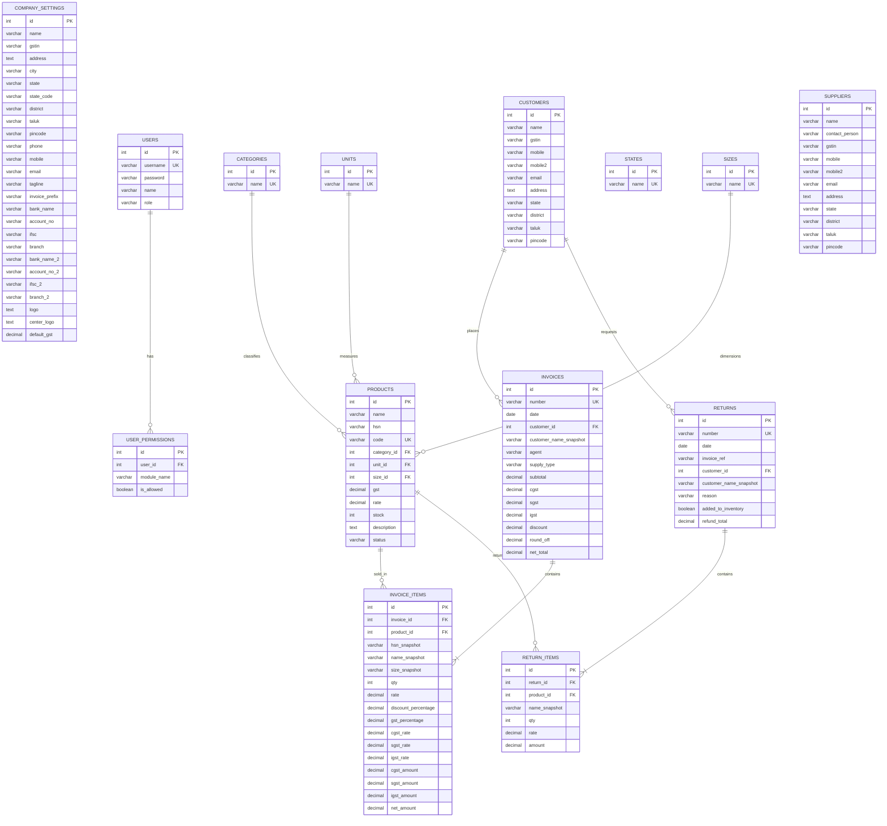

# Database Schema Specification

This document provides a comprehensive database schema design and transition plan for migrating the **BillFlow** (Shree Textiles) billing system from client-side `localStorage` to a persistent database management system (DBMS).

---

## 1. Architectural Design Choices

When designing a database for financial and billing systems, specific architectural decisions must be made to balance referential integrity with historical accuracy:

### Historical Snapshots vs. Normalization
In standard database normalization, items such as product names, HSN codes, and unit rates are stored only in the `products` table, and invoices refer to them via foreign keys. However, if a product's name or price changes in the future, past invoices must remain unchanged to preserve legal and tax records.
* **Solution**: The schema uses **Historical Snapshots** in transaction tables. Fields like `name_snapshot`, `hsn_snapshot`, `size_snapshot`, and `rate` are duplicated in `invoice_items` and `return_items` at the time of purchase/return. This guarantees audit integrity.
* **Customer Deletions**: Invoices reference `customer_id` via a foreign key, but the deletion rule is set to `ON DELETE SET NULL` (or `RESTRICT`), and the customer's name is snapshotted to `customer_name_snapshot` directly in the invoice record to ensure historical records are never orphaned or modified.

### Lookup Tables vs. Database Constraints
The UI dynamically updates configurations such as **Categories**, **Units**, and **Sizes** when a user creates a product with a new value.
* **Solution**: Instead of using fixed `ENUM` types in the database, these are stored in dynamic lookup tables (`categories`, `units`, `sizes`) with a `UNIQUE` index. This allows the application's auto-growth behavior to work seamlessly.

---

## 2. Entity-Relationship Diagram (ERD)

The following diagram illustrates the relationship between the core entities.



---

## 3. Data Dictionary

### `company_settings`
Stores details of the organization generating invoices.
* **Attributes**:
  * `id` (INT PK): Primary Key, typically set to `1` (Singleton design).
  * `name` (VARCHAR, 150): Business legal name (e.g. `Shree Textiles`).
  * `gstin` (VARCHAR, 15): GST Identification Number.
  * `address` (TEXT): Registered postal address.
  * `city` (VARCHAR, 100): City name.
  * `state` (VARCHAR, 100): State name.
  * `state_code` (VARCHAR, 2): GST State Code identifier (e.g. `33` for Tamil Nadu).
  * `district` (VARCHAR, 100): District name.
  * `taluk` (VARCHAR, 100): Taluk name.
  * `pincode` (VARCHAR, 6): Postal Code.
  * `phone` (VARCHAR, 20): Landline contact.
  * `mobile` (VARCHAR, 15): Primary mobile number.
  * `email` (VARCHAR, 255): Business email.
  * `tagline` (VARCHAR, 255): Marketing slogan.
  * `invoice_prefix` (VARCHAR, 10): Default invoice prefix (e.g. `INV`).
  * `bank_name` (VARCHAR, 150): Primary bank details.
  * `account_no` (VARCHAR, 50): Primary account number.
  * `ifsc` (VARCHAR, 11): Bank IFSC code.
  * `branch` (VARCHAR, 150): Bank branch location.
  * `bank_name_2` (VARCHAR, 150): Secondary bank details (optional).
  * `account_no_2` (VARCHAR, 50): Secondary account number (optional).
  * `ifsc_2` (VARCHAR, 11): Secondary IFSC code (optional).
  * `branch_2` (VARCHAR, 150): Secondary branch location (optional).
  * `logo` (TEXT / MEDIUMTEXT): Base64 string for business brand logo (optional).
  * `center_logo` (TEXT / MEDIUMTEXT): Base64 string for invoice center layout logo (optional).
  * `default_gst` (DECIMAL(5,2)): Default GST rate percentage (e.g. `18.00`).

### `users`
Defines system access accounts.
* **Attributes**:
  * `id` (INT PK Auto-Increment): Unique identifier.
  * `username` (VARCHAR, 50 UNIQUE): Login username.
  * `password` (VARCHAR, 255): Password hash (hashed in database integration).
  * `name` (VARCHAR, 100): User's display name.
  * `role` (VARCHAR, 20): User's operational class (e.g., `Admin`, `Staff`).

### `user_permissions`
Relational permissions model for granular module access.
* **Attributes**:
  * `id` (INT PK Auto-Increment): Unique identifier.
  * `user_id` (INT FK): Links to `users.id`, `ON DELETE CASCADE`.
  * `module_name` (VARCHAR, 50): Target module name (e.g. `products`, `settings`).
  * `is_allowed` (BOOLEAN): Flag for access allowance.
  * **Constraints**: Composite Unique key `(user_id, module_name)`.

### `products`
The product inventory master database.
* **Attributes**:
  * `id` (INT PK Auto-Increment): Unique identifier.
  * `name` (VARCHAR, 255): Full descriptive name of the product.
  * `hsn` (VARCHAR, 10): Harmonized System of Nomenclature code for GST tracking.
  * `code` (VARCHAR, 50 UNIQUE): Internal barcode / product SKU code (e.g., `TEX001`).
  * `category_id` (INT FK): Links to `categories.id`, `ON DELETE SET NULL`.
  * `unit_id` (INT FK): Links to `units.id`, `ON DELETE SET NULL`.
  * `size_id` (INT FK): Links to `sizes.id`, `ON DELETE SET NULL`.
  * `gst` (DECIMAL(5,2)): Standard tax bracket percentage (e.g., `5.00`, `12.00`).
  * `rate` (DECIMAL(12,2)): Unit price of the product.
  * `stock` (INT): Total stock quantity currently in inventory.
  * `description` (TEXT): Additional item descriptions.
  * `status` (VARCHAR, 20): Operational status (e.g. `active`, `inactive`).

### `categories` / `units` / `sizes` / `states`
Lookup reference tables allowing metadata configuration growth.
* **Attributes**:
  * `id` (INT PK Auto-Increment): Unique identifier.
  * `name` (VARCHAR, 100 UNIQUE): Normalized text value.

### `customers`
Customer relationship records.
* **Attributes**:
  * `id` (INT PK Auto-Increment): Unique identifier.
  * `name` (VARCHAR, 150): Customer full name / Business name.
  * `gstin` (VARCHAR, 15): Customer's GSTIN (optional).
  * `mobile` (VARCHAR, 15): Primary mobile number.
  * `mobile2` (VARCHAR, 15): Secondary mobile number (optional).
  * `email` (VARCHAR, 255): Email address (optional).
  * `address` (TEXT): Detailed postal address.
  * `state` (VARCHAR, 100): Customer state (enforces tax rules).
  * `district` (VARCHAR, 100): Customer district.
  * `taluk` (VARCHAR, 100): Customer taluk.
  * `pincode` (VARCHAR, 6): Area pin code.

### `suppliers`
Supplier vendor database.
* **Attributes**:
  * `id` (INT PK Auto-Increment): Unique identifier.
  * `name` (VARCHAR, 150): Supplier vendor organization name.
  * `contact_person` (VARCHAR, 150): Point of contact.
  * `gstin` (VARCHAR, 15): Supplier's GSTIN.
  * `mobile` (VARCHAR, 15): Primary contact mobile number.
  * `mobile2` (VARCHAR, 15): Secondary contact mobile number (optional).
  * `email` (VARCHAR, 255): Email address.
  * `address` (TEXT): Detailed postal address.
  * `state` (VARCHAR, 100): State of operation.
  * `district` (VARCHAR, 100): District name.
  * `taluk` (VARCHAR, 100): Taluk name.
  * `pincode` (VARCHAR, 6): Area pin code.

### `invoices`
Tax invoices header table.
* **Attributes**:
  * `id` (INT PK Auto-Increment): Unique identifier.
  * `number` (VARCHAR, 50 UNIQUE): Generated serial number (e.g., `INV-2025-001`).
  * `date` (DATE): Date of invoice issuance.
  * `customer_id` (INT FK): Links to `customers.id`, `ON DELETE SET NULL`.
  * `customer_name_snapshot` (VARCHAR, 150): Customer name snapshot at creation.
  * `agent` (VARCHAR, 100): Selling representative / counter identifier (e.g., `Self`, `Agent A`).
  * `supply_type` (VARCHAR, 20): Tax mode selection (`Intra-State` vs. `Inter-State`).
  * `subtotal` (DECIMAL(12,2)): Total taxable amount before tax application.
  * `cgst` (DECIMAL(12,2)): Total calculated CGST (Central GST) amount.
  * `sgst` (DECIMAL(12,2)): Total calculated SGST (State GST) amount.
  * `igst` (DECIMAL(12,2)): Total calculated IGST (Integrated GST) amount.
  * `discount` (DECIMAL(12,2)): Cumulative item discounts.
  * `round_off` (DECIMAL(5,2)): Rounding difference applied to net total.
  * `net_total` (DECIMAL(12,2)): Final payable invoice total.

### `invoice_items`
Detailed line items of invoices.
* **Attributes**:
  * `id` (INT PK Auto-Increment): Unique identifier.
  * `invoice_id` (INT FK): Links to `invoices.id`, `ON DELETE CASCADE`.
  * `product_id` (INT FK): Links to `products.id`, `ON DELETE SET NULL`.
  * `hsn_snapshot` (VARCHAR, 10): Product HSN at invoice time.
  * `name_snapshot` (VARCHAR, 255): Product name at invoice time.
  * `size_snapshot` (VARCHAR, 50): Product size at invoice time.
  * `qty` (INT): Quantity purchased.
  * `rate` (DECIMAL(12,2)): Product rate before discount.
  * `discount_percentage` (DECIMAL(5,2)): Discount rate applied to item line.
  * `gst_percentage` (DECIMAL(5,2)): GST rate applied to item line.
  * `cgst_rate` (DECIMAL(5,2)): CGST percentage.
  * `sgst_rate` (DECIMAL(5,2)): SGST percentage.
  * `igst_rate` (DECIMAL(5,2)): IGST percentage.
  * `cgst_amount` (DECIMAL(12,2)): Calculated CGST value.
  * `sgst_amount` (DECIMAL(12,2)): Calculated SGST value.
  * `igst_amount` (DECIMAL(12,2)): Calculated IGST value.
  * `net_amount` (DECIMAL(12,2)): Line total after discount and tax.

### `returns`
Product return note header table.
* **Attributes**:
  * `id` (INT PK Auto-Increment): Unique identifier.
  * `number` (VARCHAR, 50 UNIQUE): Return note serial code (e.g. `RET-2025-001`).
  * `date` (DATE): Date of return note creation.
  * `invoice_ref` (VARCHAR, 50): Reference invoice serial code.
  * `customer_id` (INT FK): Links to `customers.id`, `ON DELETE SET NULL`.
  * `customer_name_snapshot` (VARCHAR, 150): Customer name snapshot.
  * `reason` (VARCHAR, 255): Explanation of the return (e.g., Defective).
  * `added_to_inventory` (BOOLEAN): Specifies if inventory levels were restocked.
  * `refund_total` (DECIMAL(12,2)): Total refund amount.

### `return_items`
Detailed returned items.
* **Attributes**:
  * `id` (INT PK Auto-Increment): Unique identifier.
  * `return_id` (INT FK): Links to `returns.id`, `ON DELETE CASCADE`.
  * `product_id` (INT FK): Links to `products.id`, `ON DELETE SET NULL`.
  * `name_snapshot` (VARCHAR, 255): Product name snapshot.
  * `qty` (INT): Quantity returned.
  * `rate` (DECIMAL(12,2)): Original unit rate of item.
  * `amount` (DECIMAL(12,2)): Net line refund amount.

---

## 4. SQL DDL Scripts

### Option A: PostgreSQL Schema (Recommended)
This schema takes advantage of PostgreSQL's robust numeric precision and foreign key configurations.

```sql
-- Create Lookup tables
CREATE TABLE categories (
    id SERIAL PRIMARY KEY,
    name VARCHAR(100) UNIQUE NOT NULL
);

CREATE TABLE units (
    id SERIAL PRIMARY KEY,
    name VARCHAR(100) UNIQUE NOT NULL
);

CREATE TABLE sizes (
    id SERIAL PRIMARY KEY,
    name VARCHAR(100) UNIQUE NOT NULL
);

CREATE TABLE states (
    id SERIAL PRIMARY KEY,
    name VARCHAR(100) UNIQUE NOT NULL
);

-- Company Settings (Singleton Design)
CREATE TABLE company_settings (
    id INT PRIMARY KEY DEFAULT 1 CHECK (id = 1),
    name VARCHAR(150) NOT NULL,
    gstin VARCHAR(15),
    address TEXT,
    city VARCHAR(100),
    state VARCHAR(100),
    state_code VARCHAR(2),
    district VARCHAR(100),
    taluk VARCHAR(100),
    pincode VARCHAR(6),
    phone VARCHAR(20),
    mobile VARCHAR(15),
    email VARCHAR(255),
    tagline VARCHAR(255),
    invoice_prefix VARCHAR(10) DEFAULT 'INV',
    bank_name VARCHAR(150),
    account_no VARCHAR(50),
    ifsc VARCHAR(11),
    branch VARCHAR(150),
    bank_name_2 VARCHAR(150),
    account_no_2 VARCHAR(50),
    ifsc_2 VARCHAR(11),
    branch_2 VARCHAR(150),
    logo TEXT,
    center_logo TEXT,
    default_gst DECIMAL(5,2) DEFAULT 18.00
);

-- Users & Permissions
CREATE TABLE users (
    id SERIAL PRIMARY KEY,
    username VARCHAR(50) UNIQUE NOT NULL,
    password VARCHAR(255) NOT NULL,
    name VARCHAR(100) NOT NULL,
    role VARCHAR(20) NOT NULL DEFAULT 'Staff'
);

CREATE TABLE user_permissions (
    id SERIAL PRIMARY KEY,
    user_id INT NOT NULL REFERENCES users(id) ON DELETE CASCADE,
    module_name VARCHAR(50) NOT NULL,
    is_allowed BOOLEAN NOT NULL DEFAULT FALSE,
    CONSTRAINT uq_user_module UNIQUE (user_id, module_name)
);

-- Products Catalog
CREATE TABLE products (
    id SERIAL PRIMARY KEY,
    name VARCHAR(255) NOT NULL,
    hsn VARCHAR(10),
    code VARCHAR(50) UNIQUE,
    category_id INT REFERENCES categories(id) ON DELETE SET NULL,
    unit_id INT REFERENCES units(id) ON DELETE SET NULL,
    size_id INT REFERENCES sizes(id) ON DELETE SET NULL,
    gst DECIMAL(5,2) NOT NULL DEFAULT 5.00,
    rate DECIMAL(12,2) NOT NULL DEFAULT 0.00,
    stock INT NOT NULL DEFAULT 0,
    description TEXT,
    status VARCHAR(20) NOT NULL DEFAULT 'active'
);

-- Customers & Suppliers
CREATE TABLE customers (
    id SERIAL PRIMARY KEY,
    name VARCHAR(150) NOT NULL,
    gstin VARCHAR(15),
    mobile VARCHAR(15) NOT NULL,
    mobile2 VARCHAR(15),
    email VARCHAR(255),
    address TEXT NOT NULL,
    state VARCHAR(100) NOT NULL,
    district VARCHAR(100),
    taluk VARCHAR(100),
    pincode VARCHAR(6)
);

CREATE TABLE suppliers (
    id SERIAL PRIMARY KEY,
    name VARCHAR(150) NOT NULL,
    contact_person VARCHAR(150),
    gstin VARCHAR(15),
    mobile VARCHAR(15) NOT NULL,
    mobile2 VARCHAR(15),
    email VARCHAR(255),
    address TEXT NOT NULL,
    state VARCHAR(100) NOT NULL,
    district VARCHAR(100),
    taluk VARCHAR(100),
    pincode VARCHAR(6)
);

-- Invoices & Invoice Items
CREATE TABLE invoices (
    id SERIAL PRIMARY KEY,
    number VARCHAR(50) UNIQUE NOT NULL,
    date DATE NOT NULL DEFAULT CURRENT_DATE,
    customer_id INT REFERENCES customers(id) ON DELETE SET NULL,
    customer_name_snapshot VARCHAR(150) NOT NULL,
    agent VARCHAR(100) DEFAULT 'Self',
    supply_type VARCHAR(20) NOT NULL DEFAULT 'Intra-State',
    subtotal DECIMAL(12,2) NOT NULL DEFAULT 0.00,
    cgst DECIMAL(12,2) NOT NULL DEFAULT 0.00,
    sgst DECIMAL(12,2) NOT NULL DEFAULT 0.00,
    igst DECIMAL(12,2) NOT NULL DEFAULT 0.00,
    discount DECIMAL(12,2) NOT NULL DEFAULT 0.00,
    round_off DECIMAL(5,2) NOT NULL DEFAULT 0.00,
    net_total DECIMAL(12,2) NOT NULL DEFAULT 0.00
);

CREATE TABLE invoice_items (
    id SERIAL PRIMARY KEY,
    invoice_id INT NOT NULL REFERENCES invoices(id) ON DELETE CASCADE,
    product_id INT REFERENCES products(id) ON DELETE SET NULL,
    hsn_snapshot VARCHAR(10),
    name_snapshot VARCHAR(255) NOT NULL,
    size_snapshot VARCHAR(50),
    qty INT NOT NULL CHECK (qty > 0),
    rate DECIMAL(12,2) NOT NULL,
    discount_percentage DECIMAL(5,2) NOT NULL DEFAULT 0.00,
    gst_percentage DECIMAL(5,2) NOT NULL DEFAULT 0.00,
    cgst_rate DECIMAL(5,2) NOT NULL DEFAULT 0.00,
    sgst_rate DECIMAL(5,2) NOT NULL DEFAULT 0.00,
    igst_rate DECIMAL(5,2) NOT NULL DEFAULT 0.00,
    cgst_amount DECIMAL(12,2) NOT NULL DEFAULT 0.00,
    sgst_amount DECIMAL(12,2) NOT NULL DEFAULT 0.00,
    igst_amount DECIMAL(12,2) NOT NULL DEFAULT 0.00,
    net_amount DECIMAL(12,2) NOT NULL DEFAULT 0.00
);

-- Product Returns & Return Items
CREATE TABLE returns (
    id SERIAL PRIMARY KEY,
    number VARCHAR(50) UNIQUE NOT NULL,
    date DATE NOT NULL DEFAULT CURRENT_DATE,
    invoice_ref VARCHAR(50) NOT NULL,
    customer_id INT REFERENCES customers(id) ON DELETE SET NULL,
    customer_name_snapshot VARCHAR(150) NOT NULL,
    reason VARCHAR(255) NOT NULL,
    added_to_inventory BOOLEAN NOT NULL DEFAULT TRUE,
    refund_total DECIMAL(12,2) NOT NULL DEFAULT 0.00
);

CREATE TABLE return_items (
    id SERIAL PRIMARY KEY,
    return_id INT NOT NULL REFERENCES returns(id) ON DELETE CASCADE,
    product_id INT REFERENCES products(id) ON DELETE SET NULL,
    name_snapshot VARCHAR(255) NOT NULL,
    qty INT NOT NULL CHECK (qty > 0),
    rate DECIMAL(12,2) NOT NULL,
    amount DECIMAL(12,2) NOT NULL DEFAULT 0.00
);
```

### Option B: MySQL / MariaDB Schema
Suitable for standard relational setups.

```sql
CREATE TABLE categories (
    id INT AUTO_INCREMENT PRIMARY KEY,
    name VARCHAR(100) UNIQUE NOT NULL
) ENGINE=InnoDB;

CREATE TABLE units (
    id INT AUTO_INCREMENT PRIMARY KEY,
    name VARCHAR(100) UNIQUE NOT NULL
) ENGINE=InnoDB;

CREATE TABLE sizes (
    id INT AUTO_INCREMENT PRIMARY KEY,
    name VARCHAR(100) UNIQUE NOT NULL
) ENGINE=InnoDB;

CREATE TABLE states (
    id INT AUTO_INCREMENT PRIMARY KEY,
    name VARCHAR(100) UNIQUE NOT NULL
) ENGINE=InnoDB;

CREATE TABLE company_settings (
    id INT PRIMARY KEY DEFAULT 1,
    name VARCHAR(150) NOT NULL,
    gstin VARCHAR(15),
    address TEXT,
    city VARCHAR(100),
    state VARCHAR(100),
    state_code VARCHAR(2),
    district VARCHAR(100),
    taluk VARCHAR(100),
    pincode VARCHAR(6),
    phone VARCHAR(20),
    mobile VARCHAR(15),
    email VARCHAR(255),
    tagline VARCHAR(255),
    invoice_prefix VARCHAR(10) DEFAULT 'INV',
    bank_name VARCHAR(150),
    account_no VARCHAR(50),
    ifsc VARCHAR(11),
    branch VARCHAR(150),
    bank_name_2 VARCHAR(150),
    account_no_2 VARCHAR(50),
    ifsc_2 VARCHAR(11),
    branch_2 VARCHAR(150),
    logo LONGTEXT,
    center_logo LONGTEXT,
    default_gst DECIMAL(5,2) DEFAULT 18.00,
    CONSTRAINT chk_singleton CHECK (id = 1)
) ENGINE=InnoDB;

CREATE TABLE users (
    id INT AUTO_INCREMENT PRIMARY KEY,
    username VARCHAR(50) UNIQUE NOT NULL,
    password VARCHAR(255) NOT NULL,
    name VARCHAR(100) NOT NULL,
    role VARCHAR(20) NOT NULL DEFAULT 'Staff'
) ENGINE=InnoDB;

CREATE TABLE user_permissions (
    id INT AUTO_INCREMENT PRIMARY KEY,
    user_id INT NOT NULL,
    module_name VARCHAR(50) NOT NULL,
    is_allowed BOOLEAN NOT NULL DEFAULT FALSE,
    CONSTRAINT uq_user_module UNIQUE (user_id, module_name),
    FOREIGN KEY (user_id) REFERENCES users(id) ON DELETE CASCADE
) ENGINE=InnoDB;

CREATE TABLE products (
    id INT AUTO_INCREMENT PRIMARY KEY,
    name VARCHAR(255) NOT NULL,
    hsn VARCHAR(10),
    code VARCHAR(50) UNIQUE,
    category_id INT,
    unit_id INT,
    size_id INT,
    gst DECIMAL(5,2) NOT NULL DEFAULT 5.00,
    rate DECIMAL(12,2) NOT NULL DEFAULT 0.00,
    stock INT NOT NULL DEFAULT 0,
    description TEXT,
    status VARCHAR(20) NOT NULL DEFAULT 'active',
    FOREIGN KEY (category_id) REFERENCES categories(id) ON DELETE SET NULL,
    FOREIGN KEY (unit_id) REFERENCES units(id) ON DELETE SET NULL,
    FOREIGN KEY (size_id) REFERENCES sizes(id) ON DELETE SET NULL
) ENGINE=InnoDB;

CREATE TABLE customers (
    id INT AUTO_INCREMENT PRIMARY KEY,
    name VARCHAR(150) NOT NULL,
    gstin VARCHAR(15),
    mobile VARCHAR(15) NOT NULL,
    mobile2 VARCHAR(15),
    email VARCHAR(255),
    address TEXT NOT NULL,
    state VARCHAR(100) NOT NULL,
    district VARCHAR(100),
    taluk VARCHAR(100),
    pincode VARCHAR(6)
) ENGINE=InnoDB;

CREATE TABLE suppliers (
    id INT AUTO_INCREMENT PRIMARY KEY,
    name VARCHAR(150) NOT NULL,
    contact_person VARCHAR(150),
    gstin VARCHAR(15),
    mobile VARCHAR(15) NOT NULL,
    mobile2 VARCHAR(15),
    email VARCHAR(255),
    address TEXT NOT NULL,
    state VARCHAR(100) NOT NULL,
    district VARCHAR(100),
    taluk VARCHAR(100),
    pincode VARCHAR(6)
) ENGINE=InnoDB;

CREATE TABLE invoices (
    id INT AUTO_INCREMENT PRIMARY KEY,
    number VARCHAR(50) UNIQUE NOT NULL,
    date DATE NOT NULL,
    customer_id INT,
    customer_name_snapshot VARCHAR(150) NOT NULL,
    agent VARCHAR(100) DEFAULT 'Self',
    supply_type VARCHAR(20) NOT NULL DEFAULT 'Intra-State',
    subtotal DECIMAL(12,2) NOT NULL DEFAULT 0.00,
    cgst DECIMAL(12,2) NOT NULL DEFAULT 0.00,
    sgst DECIMAL(12,2) NOT NULL DEFAULT 0.00,
    igst DECIMAL(12,2) NOT NULL DEFAULT 0.00,
    discount DECIMAL(12,2) NOT NULL DEFAULT 0.00,
    round_off DECIMAL(5,2) NOT NULL DEFAULT 0.00,
    net_total DECIMAL(12,2) NOT NULL DEFAULT 0.00,
    FOREIGN KEY (customer_id) REFERENCES customers(id) ON DELETE SET NULL
) ENGINE=InnoDB;

CREATE TABLE invoice_items (
    id INT AUTO_INCREMENT PRIMARY KEY,
    invoice_id INT NOT NULL,
    product_id INT,
    hsn_snapshot VARCHAR(10),
    name_snapshot VARCHAR(255) NOT NULL,
    size_snapshot VARCHAR(50),
    qty INT NOT NULL CHECK (qty > 0),
    rate DECIMAL(12,2) NOT NULL,
    discount_percentage DECIMAL(5,2) NOT NULL DEFAULT 0.00,
    gst_percentage DECIMAL(5,2) NOT NULL DEFAULT 0.00,
    cgst_rate DECIMAL(5,2) NOT NULL DEFAULT 0.00,
    sgst_rate DECIMAL(5,2) NOT NULL DEFAULT 0.00,
    igst_rate DECIMAL(5,2) NOT NULL DEFAULT 0.00,
    cgst_amount DECIMAL(12,2) NOT NULL DEFAULT 0.00,
    sgst_amount DECIMAL(12,2) NOT NULL DEFAULT 0.00,
    igst_amount DECIMAL(12,2) NOT NULL DEFAULT 0.00,
    net_amount DECIMAL(12,2) NOT NULL DEFAULT 0.00,
    FOREIGN KEY (invoice_id) REFERENCES invoices(id) ON DELETE CASCADE,
    FOREIGN KEY (product_id) REFERENCES products(id) ON DELETE SET NULL
) ENGINE=InnoDB;

CREATE TABLE returns (
    id INT AUTO_INCREMENT PRIMARY KEY,
    number VARCHAR(50) UNIQUE NOT NULL,
    date DATE NOT NULL,
    invoice_ref VARCHAR(50) NOT NULL,
    customer_id INT,
    customer_name_snapshot VARCHAR(150) NOT NULL,
    reason VARCHAR(255) NOT NULL,
    added_to_inventory BOOLEAN NOT NULL DEFAULT TRUE,
    refund_total DECIMAL(12,2) NOT NULL DEFAULT 0.00,
    FOREIGN KEY (customer_id) REFERENCES customers(id) ON DELETE SET NULL
) ENGINE=InnoDB;

CREATE TABLE return_items (
    id INT AUTO_INCREMENT PRIMARY KEY,
    return_id INT NOT NULL,
    product_id INT,
    name_snapshot VARCHAR(255) NOT NULL,
    qty INT NOT NULL CHECK (qty > 0),
    rate DECIMAL(12,2) NOT NULL,
    amount DECIMAL(12,2) NOT NULL DEFAULT 0.00,
    FOREIGN KEY (return_id) REFERENCES returns(id) ON DELETE CASCADE,
    FOREIGN KEY (product_id) REFERENCES products(id) ON DELETE SET NULL
) ENGINE=InnoDB;
```

---

## 5. Mock Data Seeding Scripts (SQL Inserts)

The following scripts initialize the lookup tables and populate database records with the exact initial state specified in `store.js`.

```sql
-- 1. Populate Lookups
INSERT INTO categories (name) VALUES 
('Sarees'), ('Shirts'), ('Dress Materials'), ('Kids Wear'), 
('Trousers'), ('Home Textile'), ('Bottom Wear'), ('Traditional'), 
('Jackets'), ('Accessories');

INSERT INTO units (name) VALUES 
('Pcs'), ('Set'), ('Mtr'), ('Kg'), ('Ltr'), ('Box'), ('Pair'), ('Dozen');

INSERT INTO sizes (name) VALUES 
('S'), ('M'), ('L'), ('XL'), ('XXL'), ('38'), ('40'), ('42'), ('Free Size');

INSERT INTO states (name) VALUES 
('Andhra Pradesh'), ('Arunachal Pradesh'), ('Assam'), ('Bihar'), ('Chhattisgarh'), 
('Delhi'), ('Goa'), ('Gujarat'), ('Haryana'), ('Himachal Pradesh'), ('Jharkhand'), 
('Karnataka'), ('Kerala'), ('Madhya Pradesh'), ('Maharashtra'), ('Manipur'), 
('Meghalaya'), ('Mizoram'), ('Nagaland'), ('Odisha'), ('Punjab'), ('Rajasthan'), 
('Sikkim'), ('Tamil Nadu'), ('Telangana'), ('Tripura'), ('Uttar Pradesh'), 
('Uttarakhand'), ('West Bengal');

-- 2. Seed Company Settings
INSERT INTO company_settings (id, name, gstin, address, city, state, state_code, pincode, phone, mobile, email, tagline, invoice_prefix, bank_name, account_no, ifsc, branch) VALUES
(1, 'Shree Textiles', '33AABCT1332L1ZZ', '123, Main Road, T.Nagar', 'Chennai', 'Tamil Nadu', '33', '600017', '044-2434-5678', '9876543210', 'info@shreetextiles.com', '', 'INV', 'State Bank of India', '1234567890', 'SBIN0001234', 'T.Nagar Branch');

-- 3. Seed Users
INSERT INTO users (id, username, password, name, role) VALUES 
(1, 'admin', 'admin', 'Admin', 'Admin'),
(2, 'staff', 'staff', 'Staff Member', 'Staff');

-- 4. Seed User Permissions
-- Admin permissions (All true)
INSERT INTO user_permissions (user_id, module_name, is_allowed) VALUES
(1, 'dashboard', TRUE), (1, 'products', TRUE), (1, 'customers', TRUE),
(1, 'suppliers', TRUE), (1, 'invoices', TRUE), (1, 'returns', TRUE),
(1, 'inventory', TRUE), (1, 'reports', TRUE), (1, 'settings', TRUE);

-- Staff permissions (Selective)
INSERT INTO user_permissions (user_id, module_name, is_allowed) VALUES
(2, 'dashboard', TRUE), (2, 'products', TRUE), (2, 'customers', TRUE),
(2, 'suppliers', FALSE), (2, 'invoices', TRUE), (2, 'returns', FALSE),
(2, 'inventory', TRUE), (2, 'reports', FALSE), (2, 'settings', FALSE);

-- 5. Seed Products
INSERT INTO products (id, name, hsn, code, category_id, unit_id, size_id, gst, rate, stock, description, status) VALUES
(1, 'Cotton Saree - Kanchipuram', '5208', 'TEX001', 1, 1, NULL, 5.00, 2500.00, 45, 'Premium handloom cotton saree', 'active'),
(2, 'Silk Saree - Banarasi', '5007', 'TEX002', 1, 1, NULL, 5.00, 4500.00, 30, 'Pure silk banarasi saree', 'active'),
(3, 'Men Formal Shirt - White', '6205', 'TEX003', 2, 1, NULL, 5.00, 850.00, 120, 'Cotton formal shirt', 'active'),
(4, 'Ladies Churidar Set', '6204', 'TEX004', 3, 2, NULL, 5.00, 1200.00, 65, 'Cotton churidar with dupatta', 'active'),
(5, 'Kids T-Shirt - Printed', '6109', 'TEX005', 4, 1, NULL, 5.00, 350.00, 200, 'Printed cotton t-shirt for kids', 'active'),
(6, 'Men Denim Jeans', '6203', 'TEX006', 5, 1, NULL, 12.00, 1450.00, 80, 'Slim fit denim jeans', 'active'),
(7, 'Bedsheet Double - Floral', '6302', 'TEX007', 6, 2, NULL, 5.00, 950.00, 55, 'Double bedsheet with 2 pillow covers', 'active'),
(8, 'Towel Bath - Premium', '6302', 'TEX008', 6, 1, NULL, 5.00, 320.00, 8, 'Premium cotton bath towel', 'active'),
(9, 'Ladies Leggings', '6104', 'TEX009', 7, 1, NULL, 5.00, 280.00, 150, 'Stretchable cotton leggings', 'active'),
(10, 'Silk Dhoti - Cream', '5007', 'TEX010', 8, 1, NULL, 5.00, 680.00, 3, 'Pure silk dhoti', 'active'),
(11, 'Winter Jacket - Men', '6201', 'TEX011', 9, 1, NULL, 12.00, 2200.00, 35, 'Padded winter jacket', 'active'),
(12, 'Curtain Set - Eyelet', '6303', 'TEX012', 6, 2, NULL, 12.00, 1800.00, 5, 'Eyelet curtain with lining', 'inactive');

-- 6. Seed Customers
INSERT INTO customers (id, name, gstin, mobile, email, address, state, district, taluk, pincode) VALUES
(1, 'Rajesh Kumar', '33AADCR9876K1ZZ', '9876501234', 'rajesh@example.com', '45, Mount Road', 'Tamil Nadu', 'Chennai', 'Egmore', '600032'),
(2, 'Lakshmi Traders', '33AABCL5432M1ZZ', '9876502345', 'lakshmi@traders.com', '78, Anna Salai', 'Tamil Nadu', 'Chennai', 'Teynampet', '600002'),
(3, 'Priya Fashions', '33AABCP3210N1ZZ', '9876503456', 'priya@fashions.com', '12, Ranganathan Street', 'Tamil Nadu', 'Chennai', 'T. Nagar', '600017'),
(4, 'Mohammed Ismail', '', '9876504567', 'ismail@email.com', '90, George Town', 'Tamil Nadu', 'Chennai', 'George Town', '600001'),
(5, 'Anita Sharma', '07AADCA7654P1ZZ', '9876505678', 'anita@sharma.com', '34, Connaught Place', 'Delhi', 'New Delhi', 'Connaught Place', '110001'),
(6, 'Ganesh Textiles', '33AABCG2109Q1ZZ', '9876506789', 'ganesh@textiles.com', '56, Godown Street', 'Tamil Nadu', 'Chennai', 'Parrys', '600001'),
(7, 'Sunita Devi', '', '9876507890', '', '23, Main Bazaar', 'Tamil Nadu', 'Chennai', 'Avadi', '600040'),
(8, 'Karthik Stores', '33AABCK8765R1ZZ', '9876508901', 'karthik@stores.com', '67, Usman Road', 'Tamil Nadu', 'Chennai', 'T. Nagar', '600017');

-- 7. Seed Suppliers
INSERT INTO suppliers (id, name, contact_person, gstin, mobile, mobile2, email, address, state, district, taluk, pincode) VALUES
(1, 'Supreme Fabricators', 'Arun Kumar', '33AABCS1234K1ZZ', '9876543210', '9876543211', 'supreme@fab.com', 'B-24, Industrial Estate', 'Tamil Nadu', 'Chennai', 'Guindy', '600032'),
(2, 'Apex Steel Industries', 'Vijay Verma', '27AABCA4567R1ZZ', '9123456789', '', 'sales@apexsteel.com', '102, Wagle Estate', 'Maharashtra', 'Thane', 'Thane', '400604');

-- 8. Seed Invoices
INSERT INTO invoices (id, number, date, customer_id, customer_name_snapshot, agent, supply_type, subtotal, cgst, sgst, igst, discount, round_off, net_total) VALUES
(1, 'INV-2025-001', '2025-05-20', 1, 'Rajesh Kumar', 'Self', 'Intra-State', 7550.00, 188.75, 188.75, 0.00, 0.00, 0.50, 7928.00),
(2, 'INV-2025-002', '2025-05-21', 2, 'Lakshmi Traders', 'Agent A', 'Intra-State', 19775.00, 1126.50, 1126.50, 0.00, 725.00, 0.00, 22028.00),
(3, 'INV-2025-003', '2025-05-22', 3, 'Priya Fashions', 'Self', 'Intra-State', 4500.00, 112.50, 112.50, 0.00, 0.00, 0.00, 4725.00);

-- 9. Seed Invoice Items
-- Invoice 1 Items
INSERT INTO invoice_items (invoice_id, product_id, hsn_snapshot, name_snapshot, size_snapshot, qty, rate, discount_percentage, gst_percentage, cgst_rate, sgst_rate, igst_rate, cgst_amount, sgst_amount, igst_amount, net_amount) VALUES
(1, 1, '5208', 'Cotton Saree - Kanchipuram', '', 2, 2500.00, 0.00, 5.00, 2.50, 2.50, 0.00, 125.00, 125.00, 0.00, 5250.00),
(1, 3, '6205', 'Men Formal Shirt - White', '', 3, 850.00, 0.00, 5.00, 2.50, 2.50, 0.00, 63.75, 63.75, 0.00, 2677.50);

-- Invoice 2 Items
INSERT INTO invoice_items (invoice_id, product_id, hsn_snapshot, name_snapshot, size_snapshot, qty, rate, discount_percentage, gst_percentage, cgst_rate, sgst_rate, igst_rate, cgst_amount, sgst_amount, igst_amount, net_amount) VALUES
(2, 6, '6203', 'Men Denim Jeans', '', 10, 1450.00, 5.00, 12.00, 6.00, 6.00, 0.00, 826.50, 826.50, 0.00, 15428.00),
(2, 4, '6204', 'Ladies Churidar Set', '', 5, 1200.00, 0.00, 5.00, 2.50, 2.50, 0.00, 300.00, 300.00, 0.00, 6600.00);

-- Invoice 3 Items
INSERT INTO invoice_items (invoice_id, product_id, hsn_snapshot, name_snapshot, size_snapshot, qty, rate, discount_percentage, gst_percentage, cgst_rate, sgst_rate, igst_rate, cgst_amount, sgst_amount, igst_amount, net_amount) VALUES
(3, 2, '5007', 'Silk Saree - Banarasi', '', 1, 4500.00, 0.00, 5.00, 2.50, 2.50, 0.00, 112.50, 112.50, 0.00, 4725.00);

-- 10. Seed Returns
INSERT INTO returns (id, number, date, invoice_ref, customer_id, customer_name_snapshot, reason, added_to_inventory, refund_total) VALUES
(1, 'RET-2025-001', '2025-05-21', 'INV-2025-001', 1, 'Rajesh Kumar', 'Defective product', TRUE, 893.00);

-- 11. Seed Return Items
INSERT INTO return_items (return_id, product_id, name_snapshot, qty, rate, amount) VALUES
(1, 3, 'Men Formal Shirt - White', 1, 850.00, 893.00);
```

---

## 6. Document DB Alternative (NoSQL/MongoDB)

If migrating to a document-oriented database like **MongoDB** instead of an SQL relational engine, the schema should be redesigned to leverage nesting (embedding) for natural boundaries (such as Invoice Items within an Invoice document), while using references (IDs) for primary master collections (`users`, `products`, `customers`, `suppliers`).

### MongoDB Collections Layout

#### Collection: `company_settings`
```json
{
  "_id": {"$oid": "60c72b2f9b1d8b2bad689d01"},
  "name": "Shree Textiles",
  "gstin": "33AABCT1332L1ZZ",
  "address": "123, Main Road, T.Nagar",
  "city": "Chennai",
  "state": "Tamil Nadu",
  "stateCode": "33",
  "pincode": "600017",
  "phone": "044-2434-5678",
  "mobile": "9876543210",
  "email": "info@shreetextiles.com",
  "tagline": "",
  "invoicePrefix": "INV",
  "bankName": "State Bank of India",
  "accountNo": "1234567890",
  "ifsc": "SBIN0001234",
  "branch": "T.Nagar Branch",
  "defaultGst": 18.0
}
```

#### Collection: `products`
```json
{
  "_id": {"$oid": "60c72b2f9b1d8b2bad689d02"},
  "name": "Cotton Saree - Kanchipuram",
  "hsn": "5208",
  "code": "TEX001",
  "category": "Sarees",
  "unit": "Pcs",
  "size": "",
  "gst": 5.0,
  "rate": 2500.0,
  "stock": 45,
  "description": "Premium handloom cotton saree",
  "status": "active"
}
```

#### Collection: `customers`
```json
{
  "_id": {"$oid": "60c72b2f9b1d8b2bad689d03"},
  "name": "Rajesh Kumar",
  "gstin": "33AADCR9876K1ZZ",
  "mobile": "9876501234",
  "mobile2": "",
  "email": "rajesh@example.com",
  "address": "45, Mount Road",
  "state": "Tamil Nadu",
  "district": "Chennai",
  "taluk": "Egmore",
  "pincode": "600032"
}
```

#### Collection: `invoices`
Invoices embed the items array directly since invoice lines have no independent existence outside the invoice.
```json
{
  "_id": {"$oid": "60c72b2f9b1d8b2bad689d04"},
  "number": "INV-2025-001",
  "date": {"$date": "2025-05-20T00:00:00Z"},
  "customerId": {"$oid": "60c72b2f9b1d8b2bad689d03"},
  "customerNameSnapshot": "Rajesh Kumar",
  "agent": "Self",
  "supplyType": "Intra-State",
  "items": [
    {
      "productId": {"$oid": "60c72b2f9b1d8b2bad689d02"},
      "hsnSnapshot": "5208",
      "nameSnapshot": "Cotton Saree - Kanchipuram",
      "sizeSnapshot": "",
      "qty": 2,
      "rate": 2500.0,
      "discountPercentage": 0.0,
      "gstPercentage": 5.0,
      "cgstRate": 2.5,
      "sgstRate": 2.5,
      "igstRate": 0.0,
      "cgstAmount": 125.0,
      "sgstAmount": 125.0,
      "igstAmount": 0.0,
      "netAmount": 5250.0
    }
  ],
  "subtotal": 7550.0,
  "cgst": 188.75,
  "sgst": 188.75,
  "igst": 0.0,
  "discount": 0.0,
  "roundOff": 0.50,
  "netTotal": 7928.0
}
```

---

## 7. Migration & Connection Guide

To fully integrate a backend database with the client-side files, follow these sequence steps:

1. **Develop the Backend API**: Implement a RESTful or GraphQL server using Node.js (Express), Python (FastAPI/Django), or Java (Spring Boot).
2. **Replace Local Storage CRUD in `store.js`**: Re-code the asynchronous CRUD methods inside `/assets/js/store.js` to target backend endpoints using standard `fetch()` or `axios`.
   
   Example transition for fetching products:
   ```javascript
   // Old synchronous localStorage retrieval:
   // getProducts() { return [...this.products]; }

   // New asynchronous database retrieval:
   async getProducts() {
     try {
       const res = await fetch('/api/products');
       if (!res.ok) throw new Error('API fetch failed');
       return await res.json();
     } catch (err) {
       console.error("Failed loading products from DB:", err);
       return [];
     }
   }
   ```
3. **Refactor Client-Side UI bindings to Async/Await**: Since HTTP/Database requests are asynchronous, adjust DOM loading functions in all html pages (e.g. `renderProducts()`, `saveProduct()`) to handle `Promise` resolutions.
